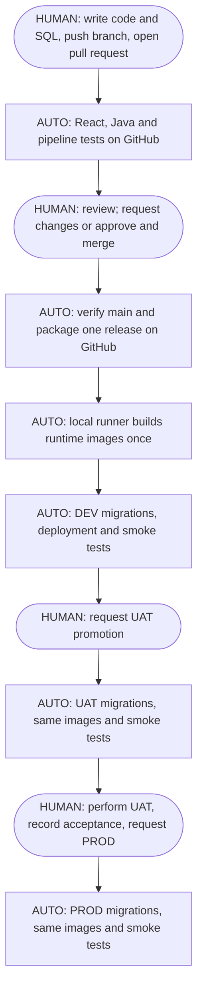

# Delivery Lab

A deliberately small **React + Java + Oracle** app for learning Continuous Integration and Continuous Delivery. The application adds, lists, and removes fictional customers. Most of the project is the pipeline, deployment scripts, and case study exercises.

**Start here:** [Local setup](docs/local-setup.md) → [GitHub setup](docs/github-setup.md) → [Case study walkthrough](docs/case-study.md).

## What you get

- One repository for React, a Java 21 / Spring Boot backend, and versioned Oracle SQL migrations.
- GitHub Actions checks for pull requests and merges to `main`.
- A release containing the frontend build, Java JAR, and deployment files; Flyway migrations are inside the JAR.
- Automatic DEV deployment after a successful main-branch build.
- Manual UAT and PROD promotion workflows with checks that the same release passed the previous environment.
- Three separate Docker Compose projects, Oracle containers, database volumes, application containers, and credentials.
- Tests for the app and promotion rules, plus a real Oracle smoke test during every deployment.

| Environment | Local URL | Human action |
|---|---|---|
| DEV | http://localhost:8080 | Review and merge a pull request; deployment then runs automatically. |
| UAT | http://localhost:8081 | Manually request promotion; then perform acceptance testing. |
| PROD | http://localhost:8082 | Confirm successful human UAT and manually request production promotion. |

Here, **PROD is a local simulation**. Use fictional records only. Authentication, TLS, advanced security scanning, and Nagios are suggested case study extensions, not implemented production safeguards.

## How the pipeline works



The frontend and Java application are built once for each main-branch release. The local runner wraps those existing outputs in Docker runtime images once, during installation. Promotion reuses the recorded image IDs; it does not rerun npm, Maven, or Docker builds. Each Oracle instance receives the same pending Flyway migrations. Customer data is never copied between environments.

The default human release decision is GitHub's **Run workflow** action. This works without paid environment-review features. It is not an independent second-person approval. The GitHub guide explains how to add enforced reviewer gates when your repository supports them.

## Quick local start

Install Node.js 24, Java 21, Python 3.10+, and Docker with Compose v2 or newer. Start Docker and allow sufficient memory; see the local guide for details. Maven is supplied through the checked-in wrapper.

From this project directory:

```bash
./scripts/local-demo.sh
```

The command tests and builds the code, generates separate local passwords, installs a release, and deploys DEV. It prints a `local-…` release ID. Keep that exact ID for subsequent promotions:

```bash
python3 scripts/lab.py deploy --release YOUR_RELEASE_ID --environment uat
# Perform the acceptance tests before the next command.
python3 scripts/lab.py deploy --release YOUR_RELEASE_ID --environment prod --accept-uat
```

Replace `YOUR_RELEASE_ID` with the printed value. GitHub releases use the full commit SHA instead. Nothing is uploaded to GitHub until you create a repository and push the project yourself.

## Project map

| Location | Purpose |
|---|---|
| `frontend/` | Small React interface and interaction tests |
| `backend/` | Java API, input validation, parameterized queries, Maven wrapper |
| `backend/src/main/resources/db/migration/` | Versioned Oracle changes; starts with `V1__create_customers.sql` |
| `.github/workflows/` | CI, automatic DEV deployment, manual promotion |
| `infra/` | Docker runtime images, proxy, isolated environment definition, database bootstrap |
| `scripts/package.py` | Package already-built artifacts and their checksums |
| `scripts/lab.py` | Install, deploy, enforce promotion order, record evidence, stop environments |
| `scripts/smoke.py` | Verify frontend version, backend version, health, validation, and real database CRUD |
| `tests/` | Failure and success cases for the release process |
| `docs/` | Setup, case study exercises, and validation results |

Generated passwords, installed releases, and deployment receipts stay in `.local/` by default and are excluded from Git. A GitHub runner must use a persistent directory outside its checkout, configured through `LAB_HOME`.

## Validation

See [verification results](docs/verification.md) for what has been tested and what still requires a running Docker engine. A passing unit test is not presented as a successful Oracle deployment.
