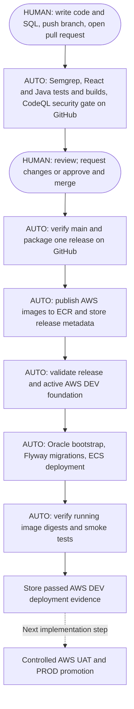

# Delivery Lab

A deliberately small **React + Java + Oracle** app for learning Continuous Integration and Continuous Delivery. The application adds, lists, and removes fictional customers. Most of the project is the pipeline, deployment scripts, and case study exercises.

**Start here:** [Local setup](docs/local-setup.md) → [GitHub setup](docs/github-setup.md) → [Case study walkthrough](docs/case-study.md).

**AWS migration — steps 1–5:** [AWS deployment guide](infra/aws/README.md)
describes disposable foundations, ECR publication and automatic **AWS DEV** deployment.
The existing Mac Actions runner controls CloudFormation/ECS and runs smoke tests;
the frontend/backend run on Fargate, and Oracle runs on RDS. DEV must be explicitly
provisioned for an eight-hour session. AWS UAT/PROD promotion is the next step.

## What you get

- One repository for React, a Java 21 / Spring Boot backend, and versioned Oracle SQL migrations.
- GitHub Actions build, test, and Semgrep/CodeQL security checks for pull requests and merges to `main`.
- A release containing the frontend build, Java JAR, and deployment files; Flyway migrations are inside the JAR.
- Main-branch CI publishes the two AWS images to ECR and records immutable digests for later AWS deployment.
- Automatic AWS DEV deployment after successful main-branch CI and ECR publication.
- Manual local UAT/PROD promotion retained until the AWS promotion workflow is implemented.
- Three separate Docker Compose projects remain available for local development and the original demonstration.
- Tests for the app and promotion rules, plus a real Oracle smoke test during every deployment.

The local demonstration remains available through `scripts/local-demo.sh` and
`scripts/lab.py`. GitHub's **Deploy DEV** now targets AWS instead of this table:

| Local environment | Local URL | Human action |
|---|---|---|
| DEV | http://localhost:8080 | Run the local demo or explicitly install/deploy a local release. |
| UAT | http://localhost:8081 | Manually request promotion; then perform acceptance testing. |
| PROD | http://localhost:8082 | Confirm successful human UAT and manually request production promotion. |

Here, **PROD is a local simulation**. Use fictional records only. Semgrep and CodeQL scan React/Java source in CI; authentication, TLS, dependency vulnerability gates, and Nagios remain suggested case study extensions.

## How the pipeline works


```mermaid
flowchart TD
  A([HUMAN: write code and SQL, push branch, open pull request]) --> B[AUTO: Semgrep, React and Java tests and builds, CodeQL security gate on GitHub]
  B --> C([HUMAN: review; request changes or approve and merge])
  C --> D[AUTO: verify main and package one release on GitHub]
  D --> P[AUTO: publish AWS images to ECR and store release metadata]
  P --> E[AUTO: validate release and active AWS DEV foundation]
  E --> F[AUTO: Oracle bootstrap, Flyway migrations, ECS deployment]
  F --> G[AUTO: verify running image digests and smoke tests]
  G --> H[Store passed AWS DEV deployment evidence]
  H -. Next implementation step .-> I[Controlled AWS UAT and PROD promotion]
```

The frontend and Java application are built once for each main-branch release. After all checks pass, CI wraps those outputs in Linux/amd64 images, publishes them to ECR and stores their digests. **Deploy DEV** verifies both artifacts from that CI run, runs separate Oracle bootstrap and Flyway tasks, and applies the ECS service through CloudFormation. It checks the running image digests and exercises frontend, API and Oracle CRUD before recording success. Deployment does not run Docker, npm or Maven. Failed CI, database tasks or smoke tests prevent a passed DEV receipt. AWS promotion is not implemented yet; the existing local promotion command still requires its own local DEV evidence.

CI runs Semgrep immediately after checkout, before application tests or builds, and stops on any reported finding. It then initializes CodeQL before the existing builds and analyzes the code afterward. A separate CodeQL gate blocks release packaging on high/critical findings or missing reports. The [GitHub guide](docs/github-setup.md#semgrep-before-tests-and-builds) explains both policies and how to require the check before merging. Promotion-rule tests remain commented out in CI for the current case-study stage; security-gate tests run independently.

The default human release decision is GitHub's **Run workflow** action. This works without paid environment-review features. It is not an independent second-person approval. The GitHub guide explains how to add enforced reviewer gates when your repository supports them.

## Quick local start

Install Node.js 24, Java 21, Python 3.10+, and Docker with Compose v2 or newer. Start Docker and allow sufficient memory; see the local guide for details. Maven is supplied through the checked-in wrapper.

From this project directory:

```bash
./scripts/local-demo.sh
```

The command tests and builds the code, generates separate local passwords, installs a release, and deploys DEV. It prints a `local-…` release ID. Keep that exact ID for subsequent promotions:

```bash
python3 scripts/lab.py deploy --release YOUR_RELEASE_ID --environment uat
# Perform the acceptance tests before the next command.
python3 scripts/lab.py deploy --release YOUR_RELEASE_ID --environment prod --accept-uat
```

Replace `YOUR_RELEASE_ID` with the printed value. GitHub releases use the full commit SHA instead. Nothing is uploaded to GitHub until you create a repository and push the project yourself.

## Project map

| Location | Purpose |
|---|---|
| `frontend/` | Small React interface and interaction tests |
| `backend/` | Java API, input validation, parameterized queries, Maven wrapper |
| `backend/src/main/resources/db/migration/` | Versioned Oracle changes; starts with `V1__create_customers.sql` |
| `.github/workflows/` | CI, automatic DEV deployment, manual promotion |
| `infra/` | Docker runtime images, proxy, isolated environment definition, database bootstrap |
| `infra/aws/` | Planned CloudFormation templates, environment profiles and offline validation |
| `scripts/package.py` | Package already-built artifacts and their checksums |
| `scripts/check_codeql.py` | Block high/critical CodeQL findings before release packaging |
| `scripts/lab.py` | Install, deploy, enforce promotion order, record evidence, stop environments |
| `scripts/smoke.py` | Verify frontend version, backend version, health, validation, and real database CRUD |
| `tests/` | Failure and success cases for the release process |
| `docs/` | Setup, case study exercises, and validation results |

Generated passwords, installed releases, and deployment receipts stay in `.local/` by default and are excluded from Git. A GitHub runner must use a persistent directory outside its checkout, configured through `LAB_HOME`.

## Validation

See [verification results](docs/verification.md) for what has been tested and what still requires a running Docker engine. A passing unit test is not presented as a successful Oracle deployment.
