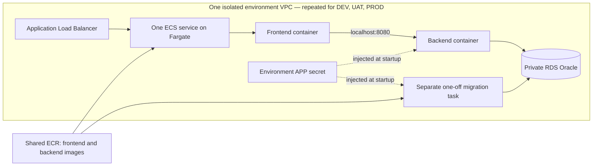

# AWS infrastructure and access: steps 1–2

The lab uses CloudFormation to provision DEV, UAT and PROD in **Ireland
(`eu-west-1`)**. Step 2 establishes GitHub OIDC access and creates the environment
foundations. Application image publication, database-user bootstrap and AWS
application deployment remain subsequent steps. The existing local CI/CD workflows
continue to work independently.

**This is a disposable academic lab:** provisioning schedules deletion of all three
environments and their fictional data **eight hours after the foundations are ready**.
There is also an initial expiry during creation, so interrupting the provisioning
process does not leave successfully created environments without a deadline.

## Templates and stack boundaries

| Template | Intended stack names | Resources and responsibility |
|---|---|---|
| `access.yaml` | `delivery-lab-access` | GitHub OIDC provider, infrastructure role, CloudFormation execution role, runtime permissions boundary and scheduled-cleanup Lambda. |
| `shared.yaml` | `delivery-lab-shared` | Two private ECR repositories, shared across DEV, UAT and PROD. Immutable image tags; repositories retained on deletion. |
| `environment.yaml` | `delivery-lab-dev`, `delivery-lab-uat`, `delivery-lab-prod` | A separate VPC, subnets, security groups, RDS Oracle instance, secrets, ECS cluster, load balancer, logs, task IAM roles and an expiry schedule per environment. |
| `migration.yaml` | `delivery-lab-dev-migration`, etc. | A standalone Fargate task definition using the release's backend image to run Flyway. Updating this stack does not update the running app. |
| `application.yaml` | `delivery-lab-dev-app`, etc. | An ECS service and task definition for the release's frontend and backend images. |

CloudFormation exports connect the stacks in the same AWS account and region.
The environment and release stacks must reference the same `SharedStackName`.
`EnvironmentStackName` selects the foundation for each application/migration
stack. With the default project name, deploy only one foundation per environment
in that account and region. Reuse these templates with another `ProjectName` and
stack names for a separate lab.



There are **two long-running application containers per task**. The frontend and
backend share a task network interface and communicate over localhost. RDS hosts
Oracle separately; it is not an ECS container. The migration task exists only
while a later workflow explicitly runs it. Local development continues to use
the three-container Docker Compose setup.

## Isolation and operational choices

- Each environment has its own VPC address range, Oracle instance, generated APP
  credentials and logs. No peering or cross-environment network rules are defined.
- Two public subnets host the load balancer and Fargate tasks. Tasks use public
  IPv4 addresses for outbound access to ECR, Secrets Manager and CloudWatch, which
  avoids one NAT gateway per environment. Their security group permits inbound
  traffic only from the load balancer on port 80; Java's port 8080 is not exposed.
- RDS resides in two isolated subnets without an internet route, is not publicly
  accessible, and accepts Oracle connections only from the environment's task
  security group. RDS storage is encrypted and backups are enabled.
- `AllowedClientCidr` is required and has no open-internet default. Prefer the
  operator's public IPv4 address with `/32`. The application has no login, so this
  restriction matters even for a fictional-data lab. Future smoke tests must run
  within AWS with narrowly scoped access, or explicitly allow their runner's
  source; arbitrary GitHub-hosted runners will not pass this restriction.
- An optional regional ACM certificate enables HTTPS and redirects HTTP. Without
  it, access is restricted HTTP for this academic lab. A certificate also requires
  a matching domain and DNS record, which are not provisioned here. This is not a
  public production security design.
- The application has no AWS API permissions. The ECS execution role can pull
  only the two lab repositories, write its environment's application logs and
  inject only its APP secret. It cannot read the database administrator secret.
- Image references require SHA-256 digests, and releases require full commit
  SHAs. Environment settings and secrets are supplied at startup. ECR scan-on-push
  is enabled, but no workflow currently uses its results as a release gate.
- The lab baseline is `db.t3.small`, 20 GiB, and Single-AZ, including the PROD
  simulation. Availability in the selected region must be checked before launch.
  Multi-AZ is an explicit parameter, not implied by having two database subnets.
- All three database profiles disable deletion protection for the approved
  eight-hour cleanup. Deleting a foundation deletes its database, automated backups,
  APP secret and application logs; no final database snapshot is created. Database
  **replacement** still creates a snapshot, which must be removed separately when
  no longer needed. RDS log exports are omitted to avoid creating unmanaged log
  groups that survive cleanup.
- The shared image repositories and access stack outlive each session. Empty ECR
  repositories and idle IAM/ECS control-plane resources do not have hourly instance
  charges; stored images and cleanup logs can incur small storage charges. Delete
  the shared/access stacks and retained repositories when the entire project ends.
- The cleanup Lambda checks the account, original stack ID and current expiry.
  Recreating or extending a session cannot let an obsolete event delete the new
  session. Future app/migration stacks must be tagged `ParentStackId` with their
  foundation's stack ID; only matching children are deleted before the foundation.
  The Lambda retries failed invocations, but AWS deletion can still fail. Confirm
  deletion in CloudFormation; scheduled cleanup is not a guaranteed spending cap.

## Budget for an eight-hour session

The baseline is deliberately small: three Single-AZ Oracle SE2 License Included
`db.t3.small` databases, **20 GiB gp3 each**, three ALBs and no NAT gateways.
No application tasks run in step 2. AWS Price List API rates checked on
25 September 2026 for Ireland were:

| Item | Rate (USD, before tax) | Eight-hour baseline |
|---|---:|---:|
| Three Oracle instances | $0.077 per instance-hour | $1.85 |
| Three ALBs | $0.0252 per ALB-hour | $0.60 |
| Minimum six public IPv4 addresses for the ALBs | $0.005 per address-hour | $0.24 |
| 60 GiB total gp3 database storage | $0.127 per GiB-month | About $0.08 |

Allow approximately **US$3–5 per session** for low lab traffic, provisioning and
cleanup time, secrets, ALB capacity units and small logging/API charges. Tax,
currency conversion, CPU credits, unusual traffic and retained snapshots/images
can change the total. Repeated sessions accumulate against the user's **€20 total
budget**; this is not an allowance of €20 per session. There is no automatic
recreation or overnight restart.

Later, running one 0.5-vCPU/1-GiB Fargate task per environment adds about $0.59
for eight hours, plus about $0.12 for their three public IPv4 addresses. These are
application deployment costs, not charges incurred by an empty ECS cluster.

## Required deployment inputs

`parameters/dev.json`, `uat.json` and `prod.json` are partial CloudFormation
parameter profiles. They intentionally omit three required inputs rather than
inventing values:

1. `AllowedClientCidr`: the operator's permitted public IPv4 range.
2. `OracleEngineVersion`: an exact, available Oracle 19c SE2 version in the chosen
   region, used consistently across all three environments.
3. `ExpiresAt`: an explicit UTC cleanup time; the helper computes eight hours.

These templates use **RDS Oracle SE2 with the License Included model**, whereas
local Compose uses Oracle Database Free 23.26. This is an engine/edition change,
not a relocation of the existing Oracle image or volume. Before deploying, check
the JDBC/Flyway compatibility and run the existing SQL migration and CRUD tests
against RDS. No customer records will be copied between environments.

The validator uses `eu-west-1` (Ireland) schemas by default. This does not
select or configure an AWS account, nor does it confirm regional database
capacity, engine versions, pricing, IAM permissions or account quotas.

## Remaining implementation before the first AWS application deployment

1. **Database bootstrap:** create the `APP` user using the generated APP secret
   through a separate, narrowly privileged task in the environment VPC. Only that
   bootstrap task should access the RDS administrator secret. Grant the schema
   permissions needed for Flyway and a bounded tablespace quota. The existing
   `infra/init-db.sh` relies on SYSDBA, FREEPDB1 and local datafiles and must **not**
   be run against RDS. Creating a Secrets Manager secret does not create an Oracle
   user or rotate that user's password.
2. **Frontend runtime configuration:** make Nginx read `BACKEND_UPSTREAM`, defaulting
   to `backend:8080` for Compose and using `127.0.0.1:8080` for this ECS task. The
   current frontend image does not read this setting yet. Preserve `/api/health`
   and `/release.json`, which are used by existing smoke tests.
3. **Image publication:** wrap the existing tested release outputs in images and
   publish to ECR once. These task definitions require Linux x86-64 images; a
   native ARM Mac image is not automatically compatible. Supply each digest and
   the same source commit SHA to the application and migration stacks.
4. **CD orchestration:** register the migration definition, explicitly run it in
   the environment's task subnets/security group with public IP enabled, wait for
   task completion, and require the migration container's exit code to be zero.
   Only then update the application stack with the same backend digest and the
   release's frontend digest, wait for service stability and run the smoke tests.
   Registering a task definition alone does not execute a migration. Tag both
   release stacks with `Project=delivery-lab`, `Purpose=academic-lab` and
   `ParentStackId=<foundation StackId>` so expiry can remove them safely.

The application service defaults to `DesiredCount=0` so registering definitions
does not start unprepared containers. After bootstrap and migrations pass, the
future deployment workflow must explicitly set it to `1` (or `2`). This does not
avoid the cost of foundation resources such as RDS and the load balancer.

ECS rollback is configured for failed service deployments. The first deployment
has no previously successful application revision to restore. Later application
rollbacks do not undo database migrations, so schema compatibility and recovery
must be handled separately. Human UAT/PROD decisions and successful-release
evidence remain workflow responsibilities; these templates do not implement them.

## Access and provisioning procedure

The first authenticated bootstrap is performed locally with AWS CLI profile
`default`. It creates the access stack from code, using `CAPABILITY_NAMED_IAM`.
GitHub subsequently uses OIDC; **no AWS access keys or database passwords are
stored in the repository or GitHub variables**.

The IAM trust uses the repository's exact `sub_claim_prefix` from
`GET /repos/swbergmann/fintech-app/actions/oidc/customization/sub`, followed by
`:environment:aws-infrastructure`. This repository uses immutable owner and
repository IDs; copying the older `repo:owner/name` example would not work.

```bash
aws cloudformation deploy --profile default --region eu-west-1 \
  --stack-name delivery-lab-access --template-file infra/aws/access.yaml \
  --capabilities CAPABILITY_NAMED_IAM \
  --parameter-overrides \
    'GitHubSubjectPrefix=repo:swbergmann@52543581/fintech-app@1361635096' \
  --tags Project=delivery-lab Purpose=academic-lab \
  --no-fail-on-empty-changeset
```

If a GitHub OIDC provider already exists in the account, supply
`ExistingOidcProviderArn` as well; the bootstrap must not create a duplicate.
Only the account administrator updates this access stack. The GitHub infrastructure
role cannot modify its own permissions or the access stack. It operates the four
foundation/shared stacks through a dedicated CloudFormation service role. That
role restricts named ECR/RDS/secrets/logging resources and IAM runtime roles; some
network/ECS/ALB operations require broader regional permissions. It is not a
blanket AWS administrator role. Use a dedicated lab account, and review these
permissions before reusing this design in a production account.

The GitHub environment **`aws-infrastructure`** contains these non-secret variables:

| Variable | Purpose |
|---|---|
| `AWS_ACCOUNT_ID` | Expected account (`637423555881`) checked before operations. |
| `AWS_REGION` | `eu-west-1`. |
| `AWS_INFRASTRUCTURE_ROLE_ARN` | `InfrastructureRoleArn` from the access stack. |
| `AWS_CLIENT_CIDR` | Current operator public IPv4 address with `/32`. Update it when your public IP changes. |

Its deployment branch policy allows `main`. An initial temporary feature-branch
exception can be used to verify OIDC before merging and must be removed afterwards.
Pull requests run static validation without AWS credentials. Pushes verify access;
only manually dispatched operations on `main` provision or delete infrastructure.

The **AWS infrastructure** workflow offers `status`, `provision` and `delete`.
`provision` creates or updates the foundations and starts a new eight-hour session;
`delete` requests early foundation deletion. Do not repeatedly provision just to
check progress, because it extends the expiry. After application stacks are added,
delete those first (or let the scheduled cleanup remove tagged children).

The same helper can run locally without merging this branch:

```bash
python3 infra/aws/provision.py verify --profile default --account 637423555881
python3 infra/aws/provision.py provision --profile default --account 637423555881 \
  --client-cidr YOUR_PUBLIC_IPV4/32
python3 infra/aws/provision.py status --profile default --account 637423555881
# Only when intentionally ending a session and deleting its fictional data:
python3 infra/aws/provision.py delete --profile default --account 637423555881
```

The helper selects the region's default Oracle 19c SE2 version and checks that
License Included, `db.t3.small` and 20 GiB gp3 are orderable before provisioning.
CloudFormation creates three independent foundations concurrently. It stores
generated database passwords in Secrets Manager; neither workflow output nor
stack outputs reveal them. Outputs include network identifiers, ECR repository
URIs, secret ARNs and cleanup time for later deployment steps.

If creation fails, inspect the stack events, correct the template or permission,
and let rollback finish. A stack in `ROLLBACK_COMPLETE` must be deleted before
retrying creation. Delete only the new lab stacks, never unrelated account resources.

## Validate without AWS credentials or Docker

From the repository root:

```bash
python3 -m venv .local/cfn-venv
.local/cfn-venv/bin/python -m pip install -r infra/aws/requirements-validation.txt
.local/cfn-venv/bin/python infra/aws/validate.py
```

This runs AWS's `cfn-lint` on every template, verifies stack import/export names,
checks that environment/subnet address ranges do not overlap, and validates the
three parameter profiles. The installation downloads packages; validation itself
does not access an AWS account or create resources. The separate `AWS infrastructure` workflow runs this validation and the cleanup
safety tests on relevant pull requests. Static validation is not evidence of a
successful AWS deployment.

## Official references

- [CloudFormation resource provisioning and templates](https://docs.aws.amazon.com/AWSCloudFormation/latest/UserGuide/Welcome.html)
- [CloudFormation linting and local validation](https://github.com/aws-cloudformation/cfn-lint)
- [Fargate networking, public IPs and communication within a task](https://docs.aws.amazon.com/AmazonECS/latest/developerguide/fargate-task-networking.html)
- [ECS Secrets Manager injection and startup behaviour](https://docs.aws.amazon.com/AmazonECS/latest/developerguide/secrets-envvar-secrets-manager.html)
- [RDS Oracle license options](https://docs.aws.amazon.com/AmazonRDS/latest/UserGuide/Oracle.Concepts.Licensing.html)
- [RDS Oracle instance classes and regional availability checks](https://docs.aws.amazon.com/AmazonRDS/latest/UserGuide/Oracle.Concepts.InstanceClasses.html)
- [CloudFormation RDS resource properties and replacement behaviour](https://docs.aws.amazon.com/AWSCloudFormation/latest/TemplateReference/aws-resource-rds-dbinstance.html)
- [ECS deployment behaviour and rollback](https://docs.aws.amazon.com/AmazonECS/latest/developerguide/deployment-type-ecs.html)

- [GitHub OIDC authentication with AWS](https://docs.github.com/en/actions/how-tos/secure-your-work/security-harden-deployments/oidc-in-aws)
- [CloudFormation service-role behaviour and permissions](https://docs.aws.amazon.com/AWSCloudFormation/latest/UserGuide/using-iam-servicerole.html)
- [EventBridge Scheduler CloudFormation resource](https://docs.aws.amazon.com/AWSCloudFormation/latest/TemplateReference/aws-resource-scheduler-schedule.html)
- [RDS Oracle pricing](https://aws.amazon.com/rds/oracle/pricing/)
- [Load-balancer pricing](https://aws.amazon.com/elasticloadbalancing/pricing/)
- [Public IPv4 pricing](https://aws.amazon.com/vpc/pricing/)
- [Fargate pricing](https://aws.amazon.com/fargate/pricing/)
