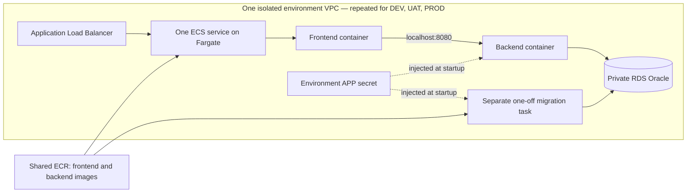

# AWS infrastructure: step 1

This directory defines the target AWS infrastructure in CloudFormation. **It has
not been deployed.** The existing CI, local DEV deployment and local promotion
workflows still operate as before. This step adds infrastructure definitions and
offline validation, not an AWS deployment workflow.

## Templates and stack boundaries

| Template | Intended stack names | Resources and responsibility |
|---|---|---|
| `shared.yaml` | `delivery-lab-shared` | Two private ECR repositories, shared across DEV, UAT and PROD. Immutable image tags; repositories retained on deletion. |
| `environment.yaml` | `delivery-lab-dev`, `delivery-lab-uat`, `delivery-lab-prod` | A separate VPC, subnets, security groups, RDS Oracle instance, secrets, ECS cluster, load balancer, logs and task IAM roles per environment. |
| `migration.yaml` | `delivery-lab-dev-migration`, etc. | A standalone Fargate task definition using the release's backend image to run Flyway. Updating this stack does not update the running app. |
| `application.yaml` | `delivery-lab-dev-app`, etc. | An ECS service and task definition for the release's frontend and backend images. |

CloudFormation exports connect the stacks in the same AWS account and region.
The environment and release stacks must reference the same `SharedStackName`.
`EnvironmentStackName` selects the foundation for each application/migration
stack. With the default project name, deploy only one foundation per environment
in that account and region. Reuse these templates with another `ProjectName` and
stack names for a separate lab.



There are **two long-running application containers per task**. The frontend and
backend share a task network interface and communicate over localhost. RDS hosts
Oracle separately; it is not an ECS container. The migration task exists only
while a later workflow explicitly runs it. Local development continues to use
the three-container Docker Compose setup.

## Isolation and operational choices

- Each environment has its own VPC address range, Oracle instance, generated APP
  credentials and logs. No peering or cross-environment network rules are defined.
- Two public subnets host the load balancer and Fargate tasks. Tasks use public
  IPv4 addresses for outbound access to ECR, Secrets Manager and CloudWatch, which
  avoids one NAT gateway per environment. Their security group permits inbound
  traffic only from the load balancer on port 80; Java's port 8080 is not exposed.
- RDS resides in two isolated subnets without an internet route, is not publicly
  accessible, and accepts Oracle connections only from the environment's task
  security group. RDS storage is encrypted and backups are enabled.
- `AllowedClientCidr` is required and has no open-internet default. Prefer the
  operator's public IPv4 address with `/32`. The application has no login, so this
  restriction matters even for a fictional-data lab. Future smoke tests must run
  within AWS with narrowly scoped access, or explicitly allow their runner's
  source; arbitrary GitHub-hosted runners will not pass this restriction.
- An optional regional ACM certificate enables HTTPS and redirects HTTP. Without
  it, access is restricted HTTP for this academic lab. A certificate also requires
  a matching domain and DNS record, which are not provisioned here. This is not a
  public production security design.
- The application has no AWS API permissions. The ECS execution role can pull
  only the two lab repositories, write its environment's application logs and
  inject only its APP secret. It cannot read the database administrator secret.
- Image references require SHA-256 digests, and releases require full commit
  SHAs. Environment settings and secrets are supplied at startup. ECR scan-on-push
  is enabled, but no workflow currently uses its results as a release gate.
- The lab baseline is `db.t3.small`, 20 GiB, and Single-AZ, including the PROD
  simulation. Availability in the selected region must be checked before launch.
  Multi-AZ is an explicit parameter, not implied by having two database subnets.
- PROD enables RDS deletion protection and seven days of database backups; DEV
  and UAT keep one day. All databases use snapshot policies for deletion and
  replacement. Snapshots preserve data for recovery; they do not automatically
  transfer data into a replacement database. Logs, APP secrets and ECR repositories
  are retained on deletion and can incur charges until deliberately removed.
- No automatic DEV/UAT working-hours schedule is added in step 1. A later cost
  control workflow must coordinate ECS task counts and supported RDS stop/start
  operations. Storage, load balancers and other retained resources still cost
  money while application tasks are stopped.

## Required deployment inputs

`parameters/dev.json`, `uat.json` and `prod.json` are partial CloudFormation
parameter profiles. They intentionally omit two required inputs rather than
inventing values:

1. `AllowedClientCidr`: the operator's permitted public IPv4 range.
2. `OracleEngineVersion`: an exact, available Oracle 19c SE2 version in the chosen
   region, used consistently across all three environments.

These templates use **RDS Oracle SE2 with the License Included model**, whereas
local Compose uses Oracle Database Free 23.26. This is an engine/edition change,
not a relocation of the existing Oracle image or volume. Before deploying, check
the JDBC/Flyway compatibility and run the existing SQL migration and CRUD tests
against RDS. No customer records will be copied between environments.

The validator uses `eu-central-1` (Frankfurt) schemas by default. This does not
select or configure an AWS account, nor does it confirm regional database
capacity, engine versions, pricing, IAM permissions or account quotas.

## Remaining implementation before the first AWS application deployment

1. **AWS access:** add the GitHub OIDC trust and deployment roles through an
   initial authenticated CloudFormation bootstrap. The roles here are ECS runtime
   roles; they do not authorize GitHub to create or update infrastructure.
2. **Database bootstrap:** create the `APP` user using the generated APP secret
   through a separate, narrowly privileged task in the environment VPC. Only that
   bootstrap task should access the RDS administrator secret. Grant the schema
   permissions needed for Flyway and a bounded tablespace quota. The existing
   `infra/init-db.sh` relies on SYSDBA, FREEPDB1 and local datafiles and must **not**
   be run against RDS. Creating a Secrets Manager secret does not create an Oracle
   user or rotate that user's password.
3. **Frontend runtime configuration:** make Nginx read `BACKEND_UPSTREAM`, defaulting
   to `backend:8080` for Compose and using `127.0.0.1:8080` for this ECS task. The
   current frontend image does not read this setting yet. Preserve `/api/health`
   and `/release.json`, which are used by existing smoke tests.
4. **Image publication:** wrap the existing tested release outputs in images and
   publish to ECR once. These task definitions require Linux x86-64 images; a
   native ARM Mac image is not automatically compatible. Supply each digest and
   the same source commit SHA to the application and migration stacks.
5. **CD orchestration:** register the migration definition, explicitly run it in
   the environment's task subnets/security group with public IP enabled, wait for
   task completion, and require the migration container's exit code to be zero.
   Only then update the application stack with the same backend digest and the
   release's frontend digest, wait for service stability and run the smoke tests.
   Registering a task definition alone does not execute a migration.

The application service defaults to `DesiredCount=0` so registering definitions
does not start unprepared containers. After bootstrap and migrations pass, the
future deployment workflow must explicitly set it to `1` (or `2`). This does not
avoid the cost of foundation resources such as RDS and the load balancer.

ECS rollback is configured for failed service deployments. The first deployment
has no previously successful application revision to restore. Later application
rollbacks do not undo database migrations, so schema compatibility and recovery
must be handled separately. Human UAT/PROD decisions and successful-release
evidence remain workflow responsibilities; these templates do not implement them.

## Validate without AWS credentials or Docker

From the repository root:

```bash
python3 -m venv .local/cfn-venv
.local/cfn-venv/bin/python -m pip install -r infra/aws/requirements-validation.txt
.local/cfn-venv/bin/python infra/aws/validate.py
```

This runs AWS's `cfn-lint` on every template, verifies stack import/export names,
checks that environment/subnet address ranges do not overlap, and validates the
three parameter profiles. The installation downloads packages; validation itself
does not access an AWS account or create resources. This check is not yet added
to `ci.yml`. Static validation is not evidence of a successful AWS deployment.

## Official references

- [CloudFormation resource provisioning and templates](https://docs.aws.amazon.com/AWSCloudFormation/latest/UserGuide/Welcome.html)
- [CloudFormation linting and local validation](https://github.com/aws-cloudformation/cfn-lint)
- [Fargate networking, public IPs and communication within a task](https://docs.aws.amazon.com/AmazonECS/latest/developerguide/fargate-task-networking.html)
- [ECS Secrets Manager injection and startup behaviour](https://docs.aws.amazon.com/AmazonECS/latest/developerguide/secrets-envvar-secrets-manager.html)
- [RDS Oracle license options](https://docs.aws.amazon.com/AmazonRDS/latest/UserGuide/Oracle.Concepts.Licensing.html)
- [RDS Oracle instance classes and regional availability checks](https://docs.aws.amazon.com/AmazonRDS/latest/UserGuide/Oracle.Concepts.InstanceClasses.html)
- [CloudFormation RDS resource properties and replacement behaviour](https://docs.aws.amazon.com/AWSCloudFormation/latest/TemplateReference/aws-resource-rds-dbinstance.html)
- [ECS deployment behaviour and rollback](https://docs.aws.amazon.com/AmazonECS/latest/developerguide/deployment-type-ecs.html)
