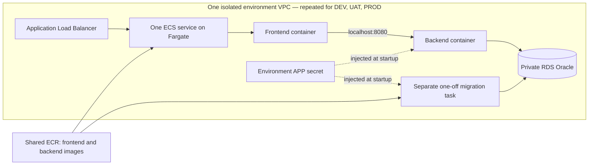

# AWS infrastructure, application and release preparation: steps 1–4

The lab uses CloudFormation to provision DEV, UAT and PROD in **Ireland
(`eu-west-1`)**. Step 2 establishes GitHub OIDC access and creates the environment
foundations. Step 3 prepares the application images and the separate Oracle
bootstrap task. Step 4 extends CI to publish the two application images to ECR
and store their digests. Execution of AWS deployments remains a subsequent step.
The existing deployment workflows still target the local lab, with successful
ECR publication now included in the CI result required for automatic DEV.

**This is a disposable academic lab:** provisioning schedules deletion of all three
environments and their fictional data **eight hours after the foundations are ready**.
There is also an initial expiry during creation, so interrupting the provisioning
process does not leave successfully created environments without a deadline.

## Templates and stack boundaries

| Template | Intended stack names | Resources and responsibility |
|---|---|---|
| `access.yaml` | `delivery-lab-access` | GitHub OIDC provider, separate infrastructure and release publishing roles, CloudFormation execution role, runtime/bootstrap permissions boundaries and scheduled-cleanup Lambda. |
| `shared.yaml` | `delivery-lab-shared` | Two private ECR repositories, shared across DEV, UAT and PROD. Immutable image tags; repositories retained on deletion. |
| `environment.yaml` | `delivery-lab-dev`, `delivery-lab-uat`, `delivery-lab-prod` | A separate VPC, subnets, security groups, RDS Oracle instance, secrets, ECS cluster, load balancer, logs, task IAM roles and an expiry schedule per environment. |
| `migration.yaml` | `delivery-lab-dev-migration`, etc. | Separate Fargate bootstrap and Flyway task definitions using the same backend image. The bootstrap alone can receive the RDS administrator secret. Registering these definitions does not execute them. |
| `application.yaml` | `delivery-lab-dev-app`, etc. | An ECS service and task definition for the release's frontend and backend images. |

CloudFormation exports connect the stacks in the same AWS account and region.
The environment and release stacks must reference the same `SharedStackName`.
`EnvironmentStackName` selects the foundation for each application/migration
stack. With the default project name, deploy only one foundation per environment
in that account and region. Reuse these templates with another `ProjectName` and
stack names for a separate lab.



There are **two long-running application containers per task**. The frontend and
backend share a task network interface and communicate over localhost. RDS hosts
Oracle separately; it is not an ECS container. The migration task exists only
while a later workflow explicitly runs it. Local development continues to use
the three-container Docker Compose setup.

## Isolation and operational choices

- Each environment has its own VPC address range, Oracle instance, generated APP
  credentials and logs. No peering or cross-environment network rules are defined.
- Two public subnets host the load balancer and Fargate tasks. Tasks use public
  IPv4 addresses for outbound access to ECR, Secrets Manager and CloudWatch, which
  avoids one NAT gateway per environment. Their security group permits inbound
  traffic only from the load balancer on port 80; Java's port 8080 is not exposed.
- RDS resides in two isolated subnets without an internet route, is not publicly
  accessible, and accepts Oracle connections only from the environment's task
  security group. RDS storage is encrypted and backups are enabled.
- `AllowedClientCidr` is required and has no open-internet default. Prefer the
  operator's public IPv4 address with `/32`. The application has no login, so this
  restriction matters even for a fictional-data lab. Future smoke tests must run
  within AWS with narrowly scoped access, or explicitly allow their runner's
  source; arbitrary GitHub-hosted runners will not pass this restriction.
- An optional regional ACM certificate enables HTTPS and redirects HTTP. Without
  it, access is restricted HTTP for this academic lab. A certificate also requires
  a matching domain and DNS record, which are not provisioned here. This is not a
  public production security design.
- The application has no AWS API permissions. The ECS execution role can pull
  only the two lab repositories, write its environment's application logs and
  inject only its APP secret. It cannot read the database administrator secret.
- Image references require SHA-256 digests, and releases require full commit
  SHAs. Environment settings and secrets are supplied at startup. ECR scan-on-push
  is enabled, but no workflow currently uses its results as a release gate.
- The lab baseline is `db.t3.small`, 20 GiB, and Single-AZ, including the PROD
  simulation. Availability in the selected region must be checked before launch.
  Multi-AZ is an explicit parameter, not implied by having two database subnets.
- All three database profiles disable deletion protection for the approved
  eight-hour cleanup. Deleting a foundation deletes its database, automated backups,
  APP secret and application logs; no final database snapshot is created. Database
  **replacement** still creates a snapshot, which must be removed separately when
  no longer needed. RDS log exports are omitted to avoid creating unmanaged log
  groups that survive cleanup.
- The shared image repositories and access stack outlive each session. Empty ECR
  repositories and idle IAM/ECS control-plane resources do not have hourly instance
  charges; stored images and cleanup logs can incur small storage charges. Delete
  the shared/access stacks and retained repositories when the entire project ends.
- The cleanup Lambda checks the account, original stack ID and current expiry.
  Recreating or extending a session cannot let an obsolete event delete the new
  session. Future app/migration stacks must be tagged `ParentStackId` with their
  foundation's stack ID; only matching children are deleted before the foundation.
  The Lambda retries failed invocations, but AWS deletion can still fail. Confirm
  deletion in CloudFormation; scheduled cleanup is not a guaranteed spending cap.

## Budget for an eight-hour session

The baseline is deliberately small: three Single-AZ Oracle SE2 License Included
`db.t3.small` databases, **20 GiB gp3 each**, three ALBs and no NAT gateways.
No application tasks run in step 2. AWS Price List API rates checked on
25 September 2026 for Ireland were:

| Item | Rate (USD, before tax) | Eight-hour baseline |
|---|---:|---:|
| Three Oracle instances | $0.077 per instance-hour | $1.85 |
| Three ALBs | $0.0252 per ALB-hour | $0.60 |
| Minimum six public IPv4 addresses for the ALBs | $0.005 per address-hour | $0.24 |
| 60 GiB total gp3 database storage | $0.127 per GiB-month | About $0.08 |

Allow approximately **US$3–5 per session** for low lab traffic, provisioning and
cleanup time, secrets, ALB capacity units and small logging/API charges. Tax,
currency conversion, CPU credits, unusual traffic and retained snapshots/images
can change the total. Repeated sessions accumulate against the user's **€20 total
budget**; this is not an allowance of €20 per session. There is no automatic
recreation or overnight restart.

Later, running one 0.5-vCPU/1-GiB Fargate task per environment adds about $0.59
for eight hours, plus about $0.12 for their three public IPv4 addresses. These are
application deployment costs, not charges incurred by an empty ECS cluster.

## Required deployment inputs

`parameters/dev.json`, `uat.json` and `prod.json` are partial CloudFormation
parameter profiles. They intentionally omit three required inputs rather than
inventing values:

1. `AllowedClientCidr`: the operator's permitted public IPv4 range.
2. `OracleEngineVersion`: an exact, available Oracle 19c SE2 version in the chosen
   region, used consistently across all three environments.
3. `ExpiresAt`: an explicit UTC cleanup time; the helper computes eight hours.

These templates use **RDS Oracle SE2 with the License Included model**, whereas
local Compose uses Oracle Database Free 23.26. This is an engine/edition change,
not a relocation of the existing Oracle image or volume. Before deploying, check
the JDBC/Flyway compatibility and run the existing SQL migration and CRUD tests
against RDS. No customer records will be copied between environments.

The validator uses `eu-west-1` (Ireland) schemas by default. This does not
select or configure an AWS account, nor does it confirm regional database
capacity, engine versions, pricing, IAM permissions or account quotas.

## Application preparation (step 3)

The frontend Dockerfile now uses the official Nginx image's startup template
mechanism. `BACKEND_UPSTREAM` defaults to `backend:8080` for Docker Compose;
`application.yaml` supplies `127.0.0.1:8080` for two containers sharing an ECS
`awsvpc` task. Only this setting is substituted: Nginx variables such as `$uri`
remain intact. Invalid upstreams fail startup. React assets, `/api/health`,
`/release.json` and client-side routes work in both layouts without rebuilding
images. The existing local Compose file and its Oracle initialization are unchanged.

The backend JAR now supports the explicit command **`--bootstrap-rds`**. It runs
before Spring starts and exits after preparing the database; normal web startup
never initializes an administrator connection. It requires `DB_URL`,
`DB_ADMIN_USERNAME=LABADMIN`, `DB_ADMIN_PASSWORD`, `DB_USERNAME=APP` and
`DB_PASSWORD`. ECS injects the credentials from the environment's existing
Secrets Manager secrets. No credentials are embedded in images or command arguments. AWS APP passwords
are now 30 alphanumeric characters, within Oracle 19c's 30-byte limit. The earlier
32-character AWS secret definition is corrected; local Oracle Free credentials
are unchanged.

Bootstrap connects as the RDS master user, creates `APP_DATA` with a 20 MiB
initial datafile and a 100 MiB maximum, and creates `APP` with a 100 MiB quota.
It grants only `CREATE SESSION`, `CREATE TABLE` and `CREATE SEQUENCE`. RDS manages
the datafile path; there is no `SYSDBA`, local filesystem path or switch to
`FREEPDB1`. Existing users, passwords and customer tables are preserved. A mismatched
existing APP password stops bootstrap before DDL instead of silently resetting it.
SQL failures return a nonzero exit with the Oracle error number but no password,
SQL text or nested driver exception. A partially failed Oracle DDL operation may
need inspection before retrying: DDL is not transactional, and bootstrap never
unlocks accounts or resets passwords as automatic recovery.

`migration.yaml` defines two distinct one-off tasks: **bootstrap**, with its own
execution role restricted to that environment's administrator and APP secrets,
and **migrate**, which receives only APP credentials. Both use the exact same
backend image digest. The new bootstrap boundary in `access.yaml` does not broaden
the existing application runtime boundary. The ECS application and Flyway tasks
still cannot read administrator credentials.

### Prepare images from tested build outputs

The existing CI produces `release.tar.gz` after its main-branch tests and builds.
The new helper verifies the archive and checksums, then wraps its JAR and static
frontend in **Linux/amd64** runtime images matching the current ECS X86_64 task
definitions. It does not run npm/Maven again, publish to ECR or start AWS resources.
It uses separate `delivery-lab-aws/*` tags so local promoted images are not replaced.

```bash
python3 scripts/prepare_aws_images.py --archive release.tar.gz
```

The receipt at `.local/aws-images/<release>.json` records source release,
manifest checksum, architecture, local tags and image IDs. Repeating the command
reuses those exact images; changed contents under the same release ID or changed
image IDs are rejected. Local image IDs are **not** ECR repository digests. The
publication step must push once, obtain repository `sha256:` digests and pass
those same digests through DEV, UAT and PROD without rebuilding.

For uncommitted development tests, package with a `local-<12 hex digits>` release
identifier, as the local lab already permits. ECS templates accept only a full
commit SHA, so such a test package cannot be mistaken for a deployable AWS release.
On Apple Silicon the x86 images require working emulation; a native Linux/x86
GitHub runner can build them directly. Docker Desktop normally includes Buildx;
a standalone Docker/Colima installation may require separate Buildx setup.

### Validate the prepared containers locally

```bash
python3 -m unittest discover -s tests -p test_aws_images.py -v
python3 scripts/test_aws_runtime.py --images .local/aws-images/<release>.json
```

The second command needs Docker, enough memory for one temporary 3 GiB Oracle
container plus the application, and access to the Oracle Free container image.
It creates its own randomly named network and containers, publishes test HTTP
ports only on loopback, and removes its containers and anonymous data volume
when it finishes. It does not access AWS or reuse local DEV/UAT/PROD databases.

This test bootstraps an APP account twice, rejects a wrong existing password,
runs Flyway, and runs the existing CRUD smoke tests through both Compose-style
DNS and ECS-style shared localhost networking **with the same prepared image IDs**.
It also checks SPA fallback and rejection of invalid configuration. The fixture
uses SYSDBA solely to create a limited LABADMIN test user on a disposable local
Oracle Free database; the application bootstrap itself uses only that user.
Passing this test does **not** prove compatibility with RDS Oracle 19c. That
integration check is required when the first AWS deployment is connected.

## Release packaging and storage (step 4)

### CI sequence and artifacts

Pull requests run the existing application/security checks and the new publication
safeguard tests. They do not package releases, request the publishing role or push
images. On a push to `main`, the **Build and test** job packages its tested React
output, Java JAR (including migrations) and deployment files into `release.tar.gz`,
then uploads the existing `release-<commit SHA>` artifact.

The new **Publish AWS release** job depends on that entire job succeeding. It:

1. Downloads the same run's `release-<commit SHA>` artifact.
2. Authenticates with GitHub OIDC and the dedicated ECR publishing role.
3. Verifies the archive checksums and that its release matches the full commit SHA.
4. Uses the archived Dockerfiles to wrap the existing outputs in Linux/amd64
   frontend/backend images. There is no second npm or Maven build.
5. Pushes each image to its private ECR repository with the commit SHA as its tag.
6. Resolves the **ECR manifest digest**, pulls by that digest and checks the image's
   architecture, source/manifest labels and local image ID.
7. Stores `aws-release.json` in a separate `aws-release-<commit SHA>` GitHub artifact.

The JSON contains the commit SHA, source CI run, account/region, archive and
manifest SHA-256 checksums, and both image repository URIs/digests. Future AWS
deployment and promotion workflows should download both artifacts from the same
successful CI run, verify the archive against this metadata, and supply the
recorded `repository@sha256:...` image references to ECS. The application templates
take `ReleaseId`, `FrontendImageDigest` and `BackendImageDigest`; repository names
come from the shared stack. **A Docker image ID is not the ECR manifest digest.**

In GitHub, open **Actions → CI → the successful main-branch run → Artifacts** to
download the two artifacts. The job summary also lists the image references.
The actual image layers are in **Amazon ECR → Private repositories →
delivery-lab/frontend or delivery-lab/backend → Images**, in Ireland. They are
not stored inside the GitHub metadata artifact.

Both GitHub artifacts are retained for 30 days. ECR images have no automatic
expiry because they may still be needed for promotion or rollback; storage
charges continue after environment cleanup. Preserve the matching artifacts
before their retention expires if an older release must remain deployable.
The ECR scan-on-push setting is informational here; this step does not introduce
a new vulnerability gate based on its results.

### Retry and failure behaviour

ECR tags are immutable. Before building anything, the publisher verifies any
images already stored for this commit against the input release manifest. A
retry reuses those images, builds only missing ones, and never overwrites a tag.
This recovers a partial push without rebuilding an already published image.
Publication jobs for the same commit are serialized in GitHub Actions.

After a publishing failure, use **Re-run failed jobs** while the original release
artifact still exists. Re-running all jobs may produce different Maven build
bytes for the same source commit or encounter an existing artifact name; the
publisher deliberately refuses to pair changed archive contents with an existing
image. Use a new commit for a new build instead of deleting or overwriting tags.
The metadata upload can replace its previous artifact on a retry, but only after
both ECR images have been verified against the original input manifest.

Any build, push, checksum or image-verification failure fails the publishing job.
No new success metadata is uploaded after such a failure. The overall CI run must
succeed before the existing **Deploy DEV** workflow proceeds. **Promote release**
still promotes locally installed images at this stage; AWS deployment/promotion
will be connected in the next step.

### Publishing access and configuration

Apply the updated `access.yaml` using the authenticated local administrator, as
shown below in **Access and provisioning procedure**. This adds
`delivery-lab-github-release`; the existing shared ECR repositories can be reused
without creating any DEV/UAT/PROD foundations. Set these **repository Actions
variables**, distinct from the existing `aws-infrastructure` environment variables:

| Variable | Value for this lab |
|---|---|
| `AWS_ACCOUNT_ID` | `637423555881` |
| `AWS_REGION` | `eu-west-1` |
| `AWS_RELEASE_ROLE_ARN` | `ReleaseRoleArn` from the access stack |

The publisher trusts the exact immutable repository subject prefix followed by
`:ref:refs/heads/main`. It does not use a GitHub environment, because that would
change its OIDC subject. PR and feature-branch subjects do not match. The job alone
gets `id-token: write`; **Build and test** does not get AWS publishing credentials.
The role can authenticate to ECR and push/read only the two named repositories.
It cannot provision resources, deploy ECS services, read database secrets, delete
images or change tag immutability. Restrict who can merge workflow changes into
`main`; the role's trust boundary is the repository's main branch.

Docker authentication uses a temporary configuration directory removed on exit.
No AWS access keys, ECR login tokens or database passwords enter the release
archive, metadata or committed configuration.

For a controlled local publication check, download a successful main CI artifact
and use its actual SHA and run ID with the authenticated AWS CLI profile:

```bash
AWS_PROFILE=default python3 scripts/publish_aws_release.py \
  --archive .download/release.tar.gz --output .local/aws-release.json \
  --account 637423555881 --region eu-west-1 \
  --release FULL_COMMIT_SHA --repository swbergmann/fintech-app --run-id CI_RUN_ID
```

This requires a local Docker daemon on macOS/Linux, AWS CLI v2 and Python.
The CI job uses the tools already installed on `ubuntu-24.04`. Local test IDs
(`local-...`) are rejected. This command stores metadata locally; only the CI
upload step makes that metadata appear in GitHub Actions.

## Remaining implementation before the first AWS application deployment

1. **Provision current foundations when ready:** the access template now includes
   the bootstrap boundary and publisher role. Create/update the environment
   foundations to export `DatabaseAdminSecretArn` and generate a 30-character APP
   password. Changing the secret does not change an existing database password:
   if an APP account already exists, reconcile its credentials deliberately before
   applying a secret change. Bootstrap will reject a mismatch. These code changes do not
   update existing AWS stacks automatically. If the eight-hour environments have
   expired, recreate them only when ready for AWS testing, within the total budget.
2. **Select a published release:** download its archive and AWS metadata from a
   successful CI run and validate their checksums and source SHA. Reuse the recorded
   repository digests for all environments.
3. **Run database preparation:** register `migration.yaml` with those values,
   then run `BootstrapTaskDefinitionArn` in the environment's task subnets/security
   group with public IP enabled. Wait for the `bootstrap` container to exit zero.
   Then run `MigrationTaskDefinitionArn` and require the `migrate` container's exit
   code to be zero. Registering a task definition does not execute it. Serialize
   deployments per environment; concurrent bootstrap operations are unsupported.
4. **Connect deployment and promotion workflows:** update `application.yaml` with
   the same image digests, wait for the service to stabilize, and run smoke tests
   from a permitted network location. Keep UAT and PROD promotion under human
   control. Tag app and migration stacks with `Project=delivery-lab`,
   `Purpose=academic-lab` and `ParentStackId=<foundation StackId>` so expiry can
   remove the application, migration and bootstrap definitions safely.

The application service defaults to `DesiredCount=0` so registering definitions
does not start unprepared containers. After bootstrap and migrations pass, the
future deployment workflow must explicitly set it to `1` (or `2`). This does not
avoid the cost of foundation resources such as RDS and the load balancer.

ECS rollback is configured for failed service deployments. The first deployment
has no previously successful application revision to restore. Later application
rollbacks do not undo database migrations, so schema compatibility and recovery
must be handled separately. Human UAT/PROD decisions and successful-release
evidence remain workflow responsibilities; these templates do not implement them.

## Access and provisioning procedure

The first authenticated bootstrap is performed locally with AWS CLI profile
`default`. It creates the access stack from code, using `CAPABILITY_NAMED_IAM`.
GitHub subsequently uses OIDC; **no AWS access keys or database passwords are
stored in the repository or GitHub variables**.

The IAM trust uses the repository's exact `sub_claim_prefix` from
`GET /repos/swbergmann/fintech-app/actions/oidc/customization/sub`, followed by
`:environment:aws-infrastructure`. This repository uses immutable owner and
repository IDs; copying the older `repo:owner/name` example would not work.

```bash
aws cloudformation deploy --profile default --region eu-west-1 \
  --stack-name delivery-lab-access --template-file infra/aws/access.yaml \
  --capabilities CAPABILITY_NAMED_IAM \
  --parameter-overrides \
    'GitHubSubjectPrefix=repo:swbergmann@52543581/fintech-app@1361635096' \
  --tags Project=delivery-lab Purpose=academic-lab \
  --no-fail-on-empty-changeset
```

If a GitHub OIDC provider already exists in the account, supply
`ExistingOidcProviderArn` as well; the bootstrap must not create a duplicate.
Only the account administrator updates this access stack. The GitHub infrastructure
role cannot modify its own permissions or the access stack. It operates the four
foundation/shared stacks through a dedicated CloudFormation service role. That
role restricts named ECR/RDS/secrets/logging resources and IAM runtime roles; some
network/ECS/ALB operations require broader regional permissions. It is not a
blanket AWS administrator role. Use a dedicated lab account, and review these
permissions before reusing this design in a production account.

The GitHub environment **`aws-infrastructure`** contains these non-secret variables:

| Variable | Purpose |
|---|---|
| `AWS_ACCOUNT_ID` | Expected account (`637423555881`) checked before operations. |
| `AWS_REGION` | `eu-west-1`. |
| `AWS_INFRASTRUCTURE_ROLE_ARN` | `InfrastructureRoleArn` from the access stack. |
| `AWS_CLIENT_CIDR` | Current operator public IPv4 address with `/32`. Update it when your public IP changes. |

Its deployment branch policy allows `main`. An initial temporary feature-branch
exception can be used to verify OIDC before merging and must be removed afterwards.
Pull requests run static validation without AWS credentials. Pushes verify access;
only manually dispatched operations on `main` provision or delete infrastructure.

The **AWS infrastructure** workflow offers `status`, `provision` and `delete`.
`provision` creates or updates the foundations and starts a new eight-hour session;
`delete` requests early foundation deletion. Do not repeatedly provision just to
check progress, because it extends the expiry. After application stacks are added,
delete those first (or let the scheduled cleanup remove tagged children).

The same helper can run locally without merging this branch:

```bash
python3 infra/aws/provision.py verify --profile default --account 637423555881
python3 infra/aws/provision.py provision --profile default --account 637423555881 \
  --client-cidr YOUR_PUBLIC_IPV4/32
python3 infra/aws/provision.py status --profile default --account 637423555881
# Only when intentionally ending a session and deleting its fictional data:
python3 infra/aws/provision.py delete --profile default --account 637423555881
```

The helper selects the region's default Oracle 19c SE2 version and checks that
License Included, `db.t3.small` and 20 GiB gp3 are orderable before provisioning.
CloudFormation creates three independent foundations concurrently. It stores
generated database passwords in Secrets Manager; neither workflow output nor
stack outputs reveal them. Outputs include network identifiers, ECR repository
URIs, secret ARNs and cleanup time for later deployment steps.

If creation fails, inspect the stack events, correct the template or permission,
and let rollback finish. A stack in `ROLLBACK_COMPLETE` must be deleted before
retrying creation. Delete only the new lab stacks, never unrelated account resources.

## Validate without AWS credentials or Docker

From the repository root:

```bash
python3 -m venv .local/cfn-venv
.local/cfn-venv/bin/python -m pip install -r infra/aws/requirements-validation.txt
.local/cfn-venv/bin/python infra/aws/validate.py
```

This runs AWS's `cfn-lint` on every template, verifies stack import/export names,
checks that environment/subnet address ranges do not overlap, and validates the
three parameter profiles. The installation downloads packages; validation itself
does not access an AWS account or create resources. The separate `AWS infrastructure` workflow runs this validation and the cleanup
safety tests on relevant pull requests. Static validation is not evidence of a
successful AWS deployment.

## Official references

- [CloudFormation resource provisioning and templates](https://docs.aws.amazon.com/AWSCloudFormation/latest/UserGuide/Welcome.html)
- [CloudFormation linting and local validation](https://github.com/aws-cloudformation/cfn-lint)
- [Fargate networking, public IPs and communication within a task](https://docs.aws.amazon.com/AmazonECS/latest/developerguide/fargate-task-networking.html)
- [ECS Secrets Manager injection and startup behaviour](https://docs.aws.amazon.com/AmazonECS/latest/developerguide/secrets-envvar-secrets-manager.html)
- [RDS Oracle license options](https://docs.aws.amazon.com/AmazonRDS/latest/UserGuide/Oracle.Concepts.Licensing.html)
- [RDS Oracle instance classes and regional availability checks](https://docs.aws.amazon.com/AmazonRDS/latest/UserGuide/Oracle.Concepts.InstanceClasses.html)
- [CloudFormation RDS resource properties and replacement behaviour](https://docs.aws.amazon.com/AWSCloudFormation/latest/TemplateReference/aws-resource-rds-dbinstance.html)
- [ECS deployment behaviour and rollback](https://docs.aws.amazon.com/AmazonECS/latest/developerguide/deployment-type-ecs.html)

- [GitHub OIDC authentication with AWS](https://docs.github.com/en/actions/how-tos/secure-your-work/security-harden-deployments/oidc-in-aws)
- [ECR permissions for image publication](https://docs.aws.amazon.com/AmazonECR/latest/userguide/image-push-iam.html)
- [ECR immutable image tags](https://docs.aws.amazon.com/AmazonECR/latest/userguide/image-tag-mutability.html)
- [ECR image lookup and manifest digests](https://docs.aws.amazon.com/cli/latest/reference/ecr/batch-get-image.html)
- [GitHub artifact storage and retention](https://github.com/actions/upload-artifact)
- [CloudFormation service-role behaviour and permissions](https://docs.aws.amazon.com/AWSCloudFormation/latest/UserGuide/using-iam-servicerole.html)
- [EventBridge Scheduler CloudFormation resource](https://docs.aws.amazon.com/AWSCloudFormation/latest/TemplateReference/aws-resource-scheduler-schedule.html)
- [RDS Oracle pricing](https://aws.amazon.com/rds/oracle/pricing/)
- [Load-balancer pricing](https://aws.amazon.com/elasticloadbalancing/pricing/)
- [Public IPv4 pricing](https://aws.amazon.com/vpc/pricing/)
- [Fargate pricing](https://aws.amazon.com/fargate/pricing/)

- [Official Nginx container template substitution](https://github.com/nginx/docker-nginx/blob/master/entrypoint/20-envsubst-on-templates.sh)
- [RDS Oracle administrator limitations](https://docs.aws.amazon.com/AmazonRDS/latest/UserGuide/Oracle.Concepts.Privileges.html)
- [RDS Oracle managed datafiles and bounded tablespaces](https://docs.aws.amazon.com/AmazonRDS/latest/UserGuide/Appendix.Oracle.CommonDBATasks.TablespacesAndDatafiles.html)
- [Docker image platforms and emulation](https://docs.docker.com/build/building/multi-platform/)

- [Oracle 19c maximum password length](https://docs.oracle.com/en/database/oracle/oracle-database/19/dbseg/minimum-requirements-passwords.html)
