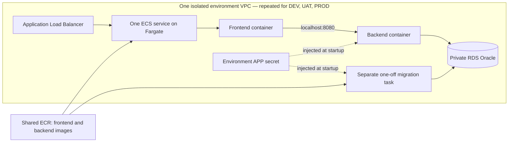

# AWS infrastructure and CI/CD delivery: steps 1–8

The lab uses CloudFormation to provision DEV, UAT and PROD in **Ireland
(`eu-west-1`)**. Step 2 establishes GitHub OIDC access and creates the environment
foundations. Step 3 prepares the application images and the separate Oracle
bootstrap task. Step 4 extends CI to publish the two application images to ECR
and store their digests. Step 5 connects **Deploy DEV** to CloudFormation,
ECS/Fargate and RDS Oracle. Step 6 enables manual **AWS UAT/PROD** promotion
with verified prior-stage evidence and human acceptance before PROD. Step 7 adds
controlled application recovery and failure diagnostics. Step 8 verifies the
complete delivery chain and records the final demonstration and acceptance evidence.

**This is a disposable academic lab:** provisioning schedules deletion of selected
environments and their fictional data **eight hours after the foundations are ready**.
There is also an initial expiry during creation, so interrupting the provisioning
process does not leave successfully created environments without a deadline.

## Templates and stack boundaries

| Template | Intended stack names | Resources and responsibility |
|---|---|---|
| `access.yaml` | `delivery-lab-access` | GitHub OIDC provider, separate infrastructure, release publishing and DEV deployment roles, CloudFormation execution role, runtime/bootstrap permissions boundaries and scheduled-cleanup Lambda. |
| `shared.yaml` | `delivery-lab-shared` | Two private ECR repositories, shared across DEV, UAT and PROD. Immutable image tags; repositories retained on deletion. |
| `environment.yaml` | `delivery-lab-dev`, `delivery-lab-uat`, `delivery-lab-prod` | A separate VPC, subnets, security groups, RDS Oracle instance, secrets, ECS cluster, load balancer, logs, task IAM roles and an expiry schedule per environment. |
| `migration.yaml` | `delivery-lab-dev-migration`, etc. | Separate Fargate bootstrap and Flyway task definitions using the same backend image. The bootstrap alone can receive the RDS administrator secret. Registering these definitions does not execute them. |
| `final-cleanup.yaml` | `delivery-lab-final-cleanup` | Separate IAM role for permanent project cleanup, retained without compute/storage charges for retries. |
| `application.yaml` | `delivery-lab-dev-app`, etc. | An ECS service and task definition for the release's frontend and backend images. |

CloudFormation exports connect the stacks in the same AWS account and region.
The environment and release stacks must reference the same `SharedStackName`.
`EnvironmentStackName` selects the foundation for each application/migration
stack. With the default project name, deploy only one foundation per environment
in that account and region. The final-cleanup helper and role are intentionally scoped to `delivery-lab` in
`eu-west-1`; a different project needs its own reviewed cleanup scope.



There are **two long-running application containers per task**. The frontend and
backend share a task network interface and communicate over localhost. RDS hosts
Oracle separately; it is not an ECS container. The migration task exists only
while the deployment workflow explicitly runs it. Local development continues to use
the three-container Docker Compose setup.

## Isolation and operational choices

- Each environment has its own VPC address range, Oracle instance, generated APP
  credentials and logs. No peering or cross-environment network rules are defined.
- Two public subnets host the load balancer and Fargate tasks. Tasks use public
  IPv4 addresses for outbound access to ECR, Secrets Manager and CloudWatch, which
  avoids one NAT gateway per environment. Their security group permits inbound
  traffic only from the load balancer on port 80; Java's port 8080 is not exposed.
- RDS resides in two isolated subnets without an internet route, is not publicly
  accessible, and accepts Oracle connections only from the environment's task
  security group. RDS storage is encrypted and backups are enabled.
- The application load balancer accepts public IPv4 traffic (`0.0.0.0/0`).
  `AllowedClientCidr` remains as a CloudFormation parameter/output for compatibility,
  but the provisioner always uses public access. The legacy `AWS_CLIENT_CIDR`
  workflow variable is ignored. Deployment no longer checks the runner's public IP.
  Only the load balancer is public: application tasks accept traffic from its
  security group and Oracle remains private. The app has no login and uses fictional data.
- An optional regional ACM certificate enables HTTPS and redirects HTTP. Without
  it, this lab uses public HTTP. A certificate also requires a matching domain and
  DNS record, which are not provisioned here. This is not a production security design.
- The application has no AWS API permissions. The ECS execution role can pull
  only the two lab repositories, write its environment's application logs and
  inject only its APP secret. It cannot read the database administrator secret.
- Image references require SHA-256 digests, and releases require full commit
  SHAs. Environment settings and secrets are supplied at startup. ECR scan-on-push
  is enabled, but no workflow currently uses its results as a release gate.
- The lab baseline is `db.t3.small`, 20 GiB, and Single-AZ, including the PROD
  simulation. Availability in the selected region must be checked before launch.
  Multi-AZ is an explicit parameter, not implied by having two database subnets.
- All three database profiles disable deletion protection for the approved
  eight-hour cleanup. Deleting a foundation deletes its database, automated backups,
  APP secret and application logs; no final database snapshot is created. Database
  **replacement** still creates a snapshot, which must be removed separately when
  no longer needed. RDS log exports are omitted to avoid creating unmanaged log
  groups that survive cleanup.
- The shared image repositories and access stack outlive each session. Empty ECR
  repositories and idle IAM/ECS control-plane resources do not have hourly instance
  charges; stored images and cleanup logs can incur small storage charges. Delete
  those resources using **AWS final cleanup** only when the entire project ends.
- The cleanup Lambda checks the account, original stack ID and current expiry.
  Recreating or extending a session cannot let an obsolete event delete the new
  session. Future app/migration stacks must be tagged `ParentStackId` with their
  foundation's stack ID; only matching children are deleted before the foundation.
  The Lambda retries failed invocations, but AWS deletion can still fail. Confirm
  deletion in CloudFormation; scheduled cleanup is not a guaranteed spending cap.

## Daily sessions versus permanent project cleanup

**AWS infrastructure** is unchanged: use `provision` to create the selected
foundation and `delete` to end all active sessions. Daily deletion retains
release images and shared access for the next session. Oracle creation still takes
around 20–25 minutes in the observed runs, so creating infrastructure is not an
instant power-on operation. Deletion is asynchronous: check CloudFormation for
`DELETE_COMPLETE` before expecting all environment resources to be gone.

After merging the public-access change, the next `provision` applies the public
load-balancer rule. Existing stacks keep their old rule until updated or recreated.
Old workflow runs use their original code: use a CI/Deploy DEV run from the new
commit. The eight-hour expiry and existing create/delete workflow inputs remain unchanged.

**AWS final cleanup** is a separate, manually started workflow for project
retirement. It is not for daily use. On `main`, type `DELETE delivery-lab` to run it.
It waits for application, migration and foundation deletion, removes shared access
and the cleanup Lambda, deletes the ECR repositories **including all releases**,
and removes project-owned snapshots, retained automated backups, secrets and logs.
It checks for remaining resources and stores `final-cleanup.json` as evidence;
failed deletion, API access errors and leftovers produce a failed run. Snapshots
and secrets must have project ownership tags; ambiguous resources are reported
rather than deleting unrelated data. API pagination is handled by AWS CLI.

The role uses the existing `aws-infrastructure` GitHub environment and its account
and region variables, with the existing `main` branch restriction. Install it once
with the administrator's existing AWS profile (no new credentials or GitHub variables):

```bash
python3 infra/aws/install_final_cleanup.py --profile default --account 637423555881
```

This updates the access template to retain the shared GitHub OIDC provider and
creates a separate IAM-only cleanup stack. It does not create environments or run
the destructive workflow. Both infrastructure templates remain version-controlled.

Final cleanup removes deployment/publishing roles, so subsequent CI runs cannot
upload fresh images or recreate lab resources. The dedicated cleanup IAM role,
its CloudFormation stack and the OIDC provider remain to allow retries; none
provisions running compute or stored application data ([IAM pricing](https://aws.amazon.com/iam/faqs/),
[CloudFormation pricing](https://aws.amazon.com/cloudformation/pricing/)). To restart the project
**after final cleanup**, bootstrap `access.yaml` again using the retained provider's
ARN as `ExistingOidcProviderArn`, then provision and publish a new release.
For ordinary daily work, continue using the original **AWS infrastructure** workflow.

The cleanup scope is this repository's project in Ireland (`eu-west-1`), not
unrelated AWS resources or other regions. It reports unexpected tagged EC2/storage
resources without deleting them automatically. Review any reported leftovers.
Historical usage can appear in billing later; a passing cleanup report is an
observed resource check, not a prediction of the entire account's invoice.

Official API references: [ECR repository and image deletion](https://docs.aws.amazon.com/AmazonECR/latest/APIReference/API_DeleteRepository.html),
[CloudFormation retention behavior](https://docs.aws.amazon.com/AWSCloudFormation/latest/TemplateReference/aws-attribute-deletionpolicy.html),
[RDS retained backup deletion](https://docs.aws.amazon.com/AmazonRDS/latest/APIReference/API_DeleteDBInstanceAutomatedBackup.html).

## Budget for an eight-hour session

The baseline is deliberately small: three Single-AZ Oracle SE2 License Included
`db.t3.small` databases, **20 GiB gp3 each**, three ALBs and no NAT gateways.
No application tasks run in step 2. AWS Price List API rates checked on
25 September 2026 for Ireland were:

| Item | Rate (USD, before tax) | Eight-hour baseline |
|---|---:|---:|
| Three Oracle instances | $0.077 per instance-hour | $1.85 |
| Three ALBs | $0.0252 per ALB-hour | $0.60 |
| Minimum six public IPv4 addresses for the ALBs | $0.005 per address-hour | $0.24 |
| 60 GiB total gp3 database storage | $0.127 per GiB-month | About $0.08 |

Allow approximately **US$3–5 per session** for low lab traffic, provisioning and
cleanup time, secrets, ALB capacity units and small logging/API charges. Tax,
currency conversion, CPU credits, unusual traffic and retained snapshots/images
can change the total. Repeated sessions accumulate against the user's **€20 total
budget**; this is not an allowance of €20 per session. There is no automatic
recreation or overnight restart.

Later, running one 0.5-vCPU/1-GiB Fargate task per environment adds about $0.59
for eight hours, plus about $0.12 for their three public IPv4 addresses. These are
application deployment costs, not charges incurred by an empty ECS cluster.

## Required deployment inputs

`parameters/dev.json`, `uat.json` and `prod.json` are partial CloudFormation
parameter profiles. They intentionally omit two required inputs rather than
inventing values:

1. `OracleEngineVersion`: an exact, available Oracle 19c SE2 version in the chosen
   region, used consistently across all three environments.
2. `ExpiresAt`: an explicit UTC cleanup time; the helper computes eight hours.

These templates use **RDS Oracle SE2 with the License Included model**, whereas
local Compose uses Oracle Database Free 23.26. This is an engine/edition change,
not a relocation of the existing Oracle image or volume. Before deploying, check
the JDBC/Flyway compatibility and run the existing SQL migration and CRUD tests
against RDS. No customer records will be copied between environments.

The validator uses `eu-west-1` (Ireland) schemas by default. This does not
select or configure an AWS account, nor does it confirm regional database
capacity, engine versions, pricing, IAM permissions or account quotas.

## Application preparation (step 3)

The frontend Dockerfile now uses the official Nginx image's startup template
mechanism. `BACKEND_UPSTREAM` defaults to `backend:8080` for Docker Compose;
`application.yaml` supplies `127.0.0.1:8080` for two containers sharing an ECS
`awsvpc` task. Only this setting is substituted: Nginx variables such as `$uri`
remain intact. Invalid upstreams fail startup. React assets, `/api/health`,
`/release.json` and client-side routes work in both layouts without rebuilding
images. The existing local Compose file and its Oracle initialization are unchanged.

The backend JAR now supports the explicit command **`--bootstrap-rds`**. It runs
before Spring starts and exits after preparing the database; normal web startup
never initializes an administrator connection. It requires `DB_URL`,
`DB_ADMIN_USERNAME=LABADMIN`, `DB_ADMIN_PASSWORD`, `DB_USERNAME=APP` and
`DB_PASSWORD`. ECS injects the credentials from the environment's existing
Secrets Manager secrets. No credentials are embedded in images or command arguments. AWS APP passwords
are now 30 alphanumeric characters, within Oracle 19c's 30-byte limit. The earlier
32-character AWS secret definition is corrected; local Oracle Free credentials
are unchanged.

Bootstrap connects as the RDS master user, creates `APP_DATA` with a 20 MiB
initial datafile and a 100 MiB maximum, and creates `APP` with a 100 MiB quota.
It grants only `CREATE SESSION`, `CREATE TABLE` and `CREATE SEQUENCE`. RDS manages
the datafile path; there is no `SYSDBA`, local filesystem path or switch to
`FREEPDB1`. Existing users, passwords and customer tables are preserved. A mismatched
existing APP password stops bootstrap before DDL instead of silently resetting it.
SQL failures return a nonzero exit with the Oracle error number but no password,
SQL text or nested driver exception. A partially failed Oracle DDL operation may
need inspection before retrying: DDL is not transactional, and bootstrap never
unlocks accounts or resets passwords as automatic recovery.

`migration.yaml` defines two distinct one-off tasks: **bootstrap**, with its own
execution role restricted to that environment's administrator and APP secrets,
and **migrate**, which receives only APP credentials. Both use the exact same
backend image digest. The new bootstrap boundary in `access.yaml` does not broaden
the existing application runtime boundary. The ECS application and Flyway tasks
still cannot read administrator credentials.

### Prepare images from tested build outputs

The existing CI produces `release.tar.gz` after its main-branch tests and builds.
The new helper verifies the archive and checksums, then wraps its JAR and static
frontend in **Linux/amd64** runtime images matching the current ECS X86_64 task
definitions. It does not run npm/Maven again, publish to ECR or start AWS resources.
It uses separate `delivery-lab-aws/*` tags so local promoted images are not replaced.

```bash
python3 scripts/prepare_aws_images.py --archive release.tar.gz
```

The receipt at `.local/aws-images/<release>.json` records source release,
manifest checksum, architecture, local tags and image IDs. Repeating the command
reuses those exact images; changed contents under the same release ID or changed
image IDs are rejected. Local image IDs are **not** ECR repository digests. The
publication step must push once, obtain repository `sha256:` digests and pass
those same digests through DEV, UAT and PROD without rebuilding.

For uncommitted development tests, package with a `local-<12 hex digits>` release
identifier, as the local lab already permits. ECS templates accept only a full
commit SHA, so such a test package cannot be mistaken for a deployable AWS release.
On Apple Silicon the x86 images require working emulation; a native Linux/x86
GitHub runner can build them directly. Docker Desktop normally includes Buildx;
a standalone Docker/Colima installation may require separate Buildx setup.

### Validate the prepared containers locally

```bash
python3 -m unittest discover -s tests -p test_aws_images.py -v
python3 scripts/test_aws_runtime.py --images .local/aws-images/<release>.json
```

The second command needs Docker, enough memory for one temporary 3 GiB Oracle
container plus the application, and access to the Oracle Free container image.
It creates its own randomly named network and containers, publishes test HTTP
ports only on loopback, and removes its containers and anonymous data volume
when it finishes. It does not access AWS or reuse local DEV/UAT/PROD databases.

This test bootstraps an APP account twice, rejects a wrong existing password,
runs Flyway, and runs the existing CRUD smoke tests through both Compose-style
DNS and ECS-style shared localhost networking **with the same prepared image IDs**.
It also checks SPA fallback and rejection of invalid configuration. The fixture
uses SYSDBA solely to create a limited LABADMIN test user on a disposable local
Oracle Free database; the application bootstrap itself uses only that user.
Passing this test does **not** prove compatibility with RDS Oracle 19c. That
integration check is performed by the step 5 deployment helper against RDS Oracle 19c.

## Release packaging and storage (step 4)

### CI sequence and artifacts

Pull requests run the existing application/security checks and the new publication
safeguard tests. They do not package releases, request the publishing role or push
images. On a push to `main`, the **Build and test** job packages its tested React
output, Java JAR (including migrations) and deployment files into `release.tar.gz`,
then uploads the existing `release-<commit SHA>` artifact.

The new **Publish AWS release** job depends on that entire job succeeding. It:

1. Downloads the same run's `release-<commit SHA>` artifact.
2. Authenticates with GitHub OIDC and the dedicated ECR publishing role.
3. Verifies the archive checksums and that its release matches the full commit SHA.
4. Uses the archived Dockerfiles to wrap the existing outputs in Linux/amd64
   frontend/backend images. There is no second npm or Maven build.
5. Pushes each image to its private ECR repository with the commit SHA as its tag.
6. Resolves the **ECR manifest digest**, pulls by that digest and checks the image's
   architecture, source/manifest labels and local image ID.
7. Stores `aws-release.json` in a separate `aws-release-<commit SHA>` GitHub artifact.

The JSON contains the commit SHA, source CI run, account/region, archive and
manifest SHA-256 checksums, and both image repository URIs/digests. Future AWS
deployment and promotion workflows should download both artifacts from the same
successful CI run, verify the archive against this metadata, and supply the
recorded `repository@sha256:...` image references to ECS. The application templates
take `ReleaseId`, `FrontendImageDigest` and `BackendImageDigest`; repository names
come from the shared stack. **A Docker image ID is not the ECR manifest digest.**

In GitHub, open **Actions → CI → the successful main-branch run → Artifacts** to
download the two artifacts. The job summary also lists the image references.
The actual image layers are in **Amazon ECR → Private repositories →
delivery-lab/frontend or delivery-lab/backend → Images**, in Ireland. They are
not stored inside the GitHub metadata artifact.

Both GitHub artifacts are retained for 30 days. ECR images have no automatic
expiry because they may still be needed for promotion or rollback; storage
charges continue after environment cleanup. Preserve the matching artifacts
before their retention expires if an older release must remain deployable.
The ECR scan-on-push setting is informational here; this step does not introduce
a new vulnerability gate based on its results.

### Retry and failure behaviour

ECR tags are immutable. Before building anything, the publisher verifies any
images already stored for this commit against the input release manifest. A
retry reuses those images, builds only missing ones, and never overwrites a tag.
This recovers a partial push without rebuilding an already published image.
Publication jobs for the same commit are serialized in GitHub Actions.

After a publishing failure, use **Re-run failed jobs** while the original release
artifact still exists. Re-running all jobs may produce different Maven build
bytes for the same source commit or encounter an existing artifact name; the
publisher deliberately refuses to pair changed archive contents with an existing
image. Use a new commit for a new build instead of deleting or overwriting tags.
The metadata upload can replace its previous artifact on a retry, but only after
both ECR images have been verified against the original input manifest.

Any build, push, checksum or image-verification failure fails the publishing job.
No new success metadata is uploaded after such a failure. The overall CI run must
succeed before **Deploy DEV** proceeds to AWS. **Promote release** reuses those published images for AWS UAT and PROD, with
verified previous-environment evidence and human UAT acceptance before PROD.

### Publishing access and configuration

Apply the updated `access.yaml` using the authenticated local administrator, as
shown below in **Access and provisioning procedure**. This adds
`delivery-lab-github-release`; the existing shared ECR repositories can be reused
without creating any DEV/UAT/PROD foundations. Set these **repository Actions
variables**, distinct from the existing `aws-infrastructure` environment variables:

| Variable | Value for this lab |
|---|---|
| `AWS_ACCOUNT_ID` | `637423555881` |
| `AWS_REGION` | `eu-west-1` |
| `AWS_RELEASE_ROLE_ARN` | `ReleaseRoleArn` from the access stack |

The publisher trusts the exact immutable repository subject prefix followed by
`:ref:refs/heads/main`. It does not use a GitHub environment, because that would
change its OIDC subject. PR and feature-branch subjects do not match. The job alone
gets `id-token: write`; **Build and test** does not get AWS publishing credentials.
The role can authenticate to ECR and push/read only the two named repositories.
It cannot provision resources, deploy ECS services, read database secrets, delete
images or change tag immutability. Restrict who can merge workflow changes into
`main`; the role's trust boundary is the repository's main branch.

Docker authentication uses a temporary configuration directory removed on exit.
No AWS access keys, ECR login tokens or database passwords enter the release
archive, metadata or committed configuration.

For a controlled local publication check, download a successful main CI artifact
and use its actual SHA and run ID with the authenticated AWS CLI profile:

```bash
AWS_PROFILE=default python3 scripts/publish_aws_release.py \
  --archive .download/release.tar.gz --output .local/aws-release.json \
  --account 637423555881 --region eu-west-1 \
  --release FULL_COMMIT_SHA --repository swbergmann/fintech-app --run-id CI_RUN_ID
```

This requires a local Docker daemon on macOS/Linux, AWS CLI v2 and Python.
The CI job uses the tools already installed on `ubuntu-24.04`. Local test IDs
(`local-...`) are rejected. This command stores metadata locally; only the CI
upload step makes that metadata appear in GitHub Actions.

## Automatic AWS DEV deployment (step 5)

### Trigger, runner and access

`deploy-dev.yml` follows a completed **CI** run, but only proceeds when that run
succeeded, was a push to `main`, and belongs to this repository. It skips an older
release if `main` has already advanced. It downloads `release-<SHA>` and
`aws-release-<SHA>` from the triggering run, not from an unrelated/latest run.

Deployment runs on a GitHub-hosted `ubuntu-24.04` runner, which includes Python,
AWS CLI v2 and GitHub CLI. **The deployed application runs in AWS**, not on the
runner. This deployment job does not use Docker or Docker Compose, and no fixed
public IP address is required. Release artifacts and deployment evidence are
transferred through GitHub Actions, so no persistent Mac runner is needed.
Local development and the Docker Compose demonstration remain available.
[Runner software](https://github.com/actions/runner-images/blob/main/images/ubuntu/Ubuntu2404-Readme.md).

Create a GitHub environment named **aws-dev**, with a custom deployment branch
rule permitting only **main** and no required reviewer for this automatic DEV
stage. Apply the updated access stack, then set its environment variable
`AWS_DEV_ROLE_ARN` to the `DevRoleArn` output. The account and region use the
repository variables established in step 4. GitHub authenticates through OIDC;
the `aws-dev` environment subject and main-only environment rule work together.
The credentials action clears existing credential environment variables first,
and the helper checks that the actual caller is the temporary GitHub DEV role.
No personal AWS keys need to be configured in the workflow.

The DEV role can read the foundation, verify ECR images, apply the two DEV child
stacks through the existing CloudFormation execution role, and run/inspect the
DEV database tasks. It cannot directly read Secrets Manager values or publish
images. The child templates execute with the shared CloudFormation service role,
so review infrastructure changes before merging into `main`. Deployment and
infrastructure workflows share a concurrency group to serialize lab operations.

### Deployment sequence and gates

`scripts/deploy_aws_dev.py` performs these steps:

1. Validate the full source SHA, repository/CI run, account/region, archive and
   manifest checksums, expected repositories and both immutable image references.
2. Require a ready, owned DEV foundation with at least an hour before its existing
   cleanup deadline.
   Missing/expired foundations fail clearly; deployments never provision or extend
   a session automatically. The public HTTP baseline is supported; a configured
   certificate requires adding a matching hostname to the smoke-test configuration.
3. Compare the ECR tag's digest with the published metadata. For an OCI index,
   resolve its single Linux/amd64 image for the later running-container check.
4. Apply the archived `migration.yaml` through CloudFormation. Run its bootstrap
   task and require an explicit zero exit code, then run Flyway and require zero.
   Both use the already published backend image. Only bootstrap receives the RDS
   administrator secret; Flyway receives APP credentials. The job never reads them.
5. Apply the archived `application.yaml`, using both recorded image digests and
   `DesiredCount=1`. Wait for ECS to finish the requested deployment, then verify
   the healthy running task's definition and both image digests. A rollback to a
   previous task definition does not count as success for the requested release.
6. Run the existing smoke tests through the load balancer: health, frontend HTML,
   matching frontend/backend release and environment, input validation, and real
   Oracle create/list/delete. The fictional test record is removed.
7. Record success only after every gate passes. The workflow uploads
   `aws-dev-<SHA>` containing `aws-dev-receipt.json`, with the CI source, image
   digests, foundation identity, task identifiers, URL, expiry and completion time.
   A failed attempt records `status: failed`; it cannot supply passed DEV evidence.

Database tasks have a 15-minute deadline and are stopped on a caught wait failure.
Both release stacks carry `ParentStackId` so cleanup can verify session ownership.
The expiry Lambda deletes owned child stacks, stops any remaining standalone
lab tasks, then deletes the foundation. The explicit infrastructure `delete`
operation follows the same dependency order. Neither path rebuilds images or
copies records between environments.

ECS can roll back a failed service deployment if a previously completed deployment
exists. It cannot roll back the first deployment, and application rollback does
not undo database migrations. A later smoke-test failure blocks success evidence
but does not automatically restore an older application; inspect the failure
before retrying. A child stack in `ROLLBACK_COMPLETE` needs deliberate cleanup
before CloudFormation can recreate it; the deployment helper does not delete it.

### Start a short DEV session and inspect the result

In **AWS infrastructure → Run workflow**, select `provision` and `dev`.
No IP configuration is required.
The selected foundation uses the smallest configured sizes and receives its own
eight-hour deadline. UAT/PROD need not be provisioned for a DEV demonstration.

After the foundation is ready, merge a PR so CI publishes a release and triggers
Deploy DEV. If the latest release previously failed only because its foundation
was absent, rerun that **Deploy DEV** run. The deployment summary contains the
public AWS application URL and cleanup time.
Download the DEV receipt from the workflow's **Artifacts** section. It is retained
for 30 days, while the actual environment remains temporary.

A local integration check can use the same deployment helper with artifacts
already downloaded from a successful main CI run:

```bash
python3 scripts/deploy_aws_dev.py --profile default \
  --archive .download/release.tar.gz --metadata .download/aws-release.json \
  --output .local/aws-dev-receipt.json --release FULL_COMMIT_SHA \
  --repository swbergmann/fintech-app --ci-run-id CI_RUN_ID \
  --account 637423555881 --region eu-west-1
```

This uses the local CLI profile; it does not test GitHub's OIDC exchange and does
not upload its local receipt to GitHub. Keep local checks separate from the
workflow evidence used for later automated promotion.

## Controlled AWS UAT and PROD promotion (step 6)

### Select a release and its evidence

**Promote release** (`.github/workflows/promote.yml`) is a manual, main-branch
workflow. It runs the same Python deployment engine as DEV on a GitHub-hosted
`ubuntu-24.04` runner. The target is AWS ECS/Fargate and RDS; Docker Compose
remains a local option through `scripts/lab.py`, not the GitHub promotion workflow.

| Input | UAT deployment | PROD deployment |
|---|---|---|
| Branch | `main` | `main` |
| `environment` | `uat` | `prod` |
| `release_id` | Full commit SHA from a successful AWS DEV run | Same SHA that passed AWS UAT |
| `previous_run_id` | Numeric **Deploy DEV** run ID | Numeric **Promote release** run ID that deployed UAT |
| `accept_uat` | Leave unchecked; testing follows deployment | Check only after human acceptance testing passed for this SHA in UAT |

The run ID is the number after `/actions/runs/` in the previous run's URL.
It is not the CI run ID or the job ID. Requiring a specific run avoids silently
choosing another release or unrelated deployment. The summary of a successful
UAT run supplies its run ID for the subsequent PROD request.

Manual dispatch is the release owner's decision; the checkbox records human
attestation. It does not perform acceptance testing or require a second approver.
Optional independent reviewers can be configured on `aws-uat`/`aws-prod` where
supported, without adding a second workflow that bypasses these gates.

### Environment access and prerequisites

Apply `access.yaml` using the existing local bootstrap procedure. It adds separate
`delivery-lab-github-uat` and `delivery-lab-github-prod` roles. Create the GitHub
environments **aws-uat** and **aws-prod**, each with a custom deployment branch
policy allowing **main** only. Set **AWS_PROMOTION_ROLE_ARN** in each environment
to its corresponding `UatRoleArn` or `ProdRoleArn` stack output. Continue using
the repository's `AWS_ACCOUNT_ID` and `AWS_REGION` variables.

Each role trusts only its own GitHub environment OIDC subject. It can deploy its
own application/migration stacks, run its own database tasks, verify ECR images,
and read the immediately preceding environment's foundation and application
stack. It cannot directly read database passwords or push images. Templates
still execute through the shared CloudFormation service role; trusted review of
infrastructure changes on `main` remains necessary.

Before promotion, explicitly provision the target through **AWS infrastructure**,
selecting `provision` and `uat` or `prod`. Keep the previous environment available
until promotion starts, with the verified release still deployed. Both must belong
to the expected account and session. The target needs at least 60 minutes before
cleanup; the previous environment needs at least 15 minutes. Each target keeps
its independently scheduled eight-hour cleanup. Promotion never provisions
foundations or extends their expiry. Provision only the environments needed for
that session; retain the approved small lab sizes, including simulated PROD.

DEV deployment, promotion and infrastructure operations share the
`delivery-lab-aws` concurrency group. Avoid simultaneous local deployment commands,
which are outside GitHub's concurrency control. The Mac must remain online and have internet access.

### Verification and deployment sequence

`scripts/promote_aws_release.py` enforces the following gates:

1. Validate the full SHA and prior run ID. Reject PROD without human UAT acceptance
   before any AWS operation; reject premature acceptance on a UAT deployment.
2. Query GitHub for the explicitly selected successful main-branch workflow run,
   verifying workflow identity, event, repository and branch. DEV evidence must
   come from `deploy-dev.yml`; UAT evidence must come from `promote.yml`.
3. Download the matching, unexpired deployment artifact from that run. Verify its
   ZIP digest against GitHub's metadata, require a passed receipt for the same
   release/environment, and reject evidence predating a rerun. For PROD, verify
   the UAT workflow attempt and its recorded chain back to unchanged DEV evidence.
   A local receipt cannot substitute for a successful GitHub UAT run.
4. Resolve the original successful main CI run from that receipt. Download both
   `release-<SHA>` and `aws-release-<SHA>` from that exact run, check the GitHub ZIP
   digests, archive and manifest checksums, and require the same image metadata
   as the previous deployment. Missing/expired artifacts stop promotion; they are
   retained for 30 days, independently of AWS environment lifetimes.
5. Verify temporary credentials for the selected environment role. Confirm the
   previous foundation has not been recreated and its application stack still
   identifies the verified release, task definition and image digests. Require a
   ready target foundation and matching ECR digests.
6. Use the shared `scripts/aws_deployment.py` engine to apply the **archived**
   migration/application templates, bootstrap the target's Oracle APP schema,
   run Flyway, deploy the same frontend/backend digests, verify the healthy ECS
   task and run HTTP/API/Oracle smoke tests. No npm/Maven build, Docker build,
   ECR image publication or database-data copying occurs during promotion.
7. Upload `aws-uat-<SHA>` or `aws-prod-<SHA>`, containing
   `aws-uat-receipt.json` or `aws-prod-receipt.json`. A successful receipt records
   the GitHub execution identity, previous run/artifact identity, exact release
   and digests, requester, UAT attestation, target session, task IDs, URL and expiry.
   Any failure prevents a passed receipt and blocks subsequent promotion.

The release archive supplies tested application templates, while the selected
main workflow revision supplies the deployment controller. An older release can
therefore be promoted without rebuilding it. If DEV/UAT has since been replaced
by another release or recreated, deploy the intended release there again before
promoting; repeat human testing if the accepted UAT deployment changed.

Smoke tests cover health, release/environment labels, validation and Oracle CRUD.
After UAT deployment, perform the [human acceptance checklist](../../docs/case-study.md#human-uat-checklist)
and record the tester, SHA, date, results and defects. Only then request PROD.
ECS service rollback and migration limitations are the same as DEV: a failed
smoke test blocks evidence but does not automatically undo application changes,
and database migrations are never automatically reversed.

### Local verification and testing

The same helper can perform a read-only preflight once both environments exist:

```bash
python3 scripts/promote_aws_release.py --profile default --verify-only \
  --environment uat --release FULL_COMMIT_SHA --previous-run-id DEV_RUN_ID \
  --repository swbergmann/fintech-app --account 637423555881 --region eu-west-1 \
  --output .local/aws-uat-preflight.json
```

Without `--verify-only`, this performs an actual deployment. Local integration
receipts carry `execution.kind: local`; they are not uploaded automatically and
cannot satisfy PROD's GitHub UAT evidence gate. End-to-end GitHub promotion/OIDC
must be demonstrated after this workflow is merged to `main`. Do not claim that
a locally tested helper proves that the new GitHub workflow has run successfully.

CI executes both AWS deployment and promotion gate tests. They cover failed or
untrusted workflow evidence, stale/altered artifacts, wrong digests, changed
sessions/releases, missing acceptance, wrong AWS credentials, deployment failures,
and use of identical digests in UAT/PROD. The original local Compose promotion
rule test remains commented out at the earlier case-study author's request.

Official references: [GitHub workflow runs](https://docs.github.com/en/rest/actions/workflow-runs),
[GitHub artifact metadata and downloads](https://docs.github.com/en/rest/actions/artifacts),
[GitHub environment rules](https://docs.github.com/en/actions/how-tos/deploy/configure-and-manage-deployments/manage-environments).

## Deployment recovery (step 7)

### Automatic service rollback and controlled recovery

`application.yaml` already enables the ECS deployment circuit breaker with
rollback. ECS can return a failed service deployment to its last completed
service deployment; without a completed deployment, there is no automatic
rollback target. This responds to task startup/health failures, not all business
or API failures. A service that starts successfully but fails the later smoke
test still needs investigation and an explicit recovery decision.
[Source: AWS circuit breaker](https://docs.aws.amazon.com/AmazonECS/latest/developerguide/deployment-circuit-breaker.html).

The new **Recover deployment** workflow (`recover.yml`) provides that manual path.
It runs on a GitHub-hosted `ubuntu-24.04` runner and reuses the GitHub OIDC
environments and environment-specific roles. No new instances, role variables,
image builds or long-lived credentials are required. It shares `delivery-lab-aws` concurrency with deployment and
infrastructure operations. Keep the environment's original eight-hour deadline;
recovery never provisions, extends or recreates it.

| Input | Meaning |
|---|---|
| Branch | `main` only |
| `environment` | Existing `dev`, `uat` or `prod` environment |
| `release_id` | Full SHA previously verified in this same environment and session |
| `previous_run_id` | Successful original Deploy DEV or Promote release run for that SHA/environment |
| `verify_only` | Defaults to true: check prerequisites without changing AWS |
| `confirm_recovery` | Required when applying recovery; records the operator's decision to retain database state and restore application images |

A previously successful UAT release alone cannot authorize PROD recovery. The
target needs its own successful PROD evidence, including the recorded UAT
acceptance and promotion chain. Local test receipts and recovery receipts cannot
replace these original GitHub deployment records.

### Recovery checks and scope

`scripts/recover_aws_release.py` checks the following before executing an update:

1. The target environment is owned, ready, has at least an hour before cleanup,
   and belongs to the same foundation session as the successful target deployment.
   Busy stacks,
   `UPDATE_ROLLBACK_FAILED`, `ROLLBACK_COMPLETE`, missing environments or a stopped
   lab fail closed. Resolve the original stack problem first.
2. The selected successful main-branch deployment and its CI artifacts pass the
   same GitHub provenance, digest and manifest checks used for promotion.
   Recovery also verifies the original PROD acceptance where applicable.
3. The latest migration stack must identify one successful main CI release and
   the backend digest recorded by that release. Compare its packaged migration
   bundle with the target's: every versioned SQL file, bundled Flyway library and
   application configuration file must be byte-for-byte identical. Even an
   intentionally backward-compatible schema change blocks this simple recovery
   path. This deliberately narrow policy suits the lab; changed schemas require
   a separately tested forward fix.
4. ECS must still retain the latest bootstrap and migration task records for the
   current migration definitions. Both must have stopped with explicit exit code
   zero, the expected image, and no command/environment overrides. Running,
   failed, missing or incomplete task evidence blocks recovery. ECS retains
   stopped tasks for **at least one hour**, not indefinitely; this is a short
   incident-recovery window, independent of artifact retention.
   [Source: AWS DescribeTasks](https://docs.aws.amazon.com/AmazonECS/latest/APIReference/API_DescribeTasks.html).
5. The deployed application template must match the reviewed template in the
   selected controller revision. Infrastructure validation requires that template
   to contain only the ECS task/service, keep application `DB_MIGRATE=false`, and
   retain the circuit breaker. Unexpected template changes need review rather
   than an automatic configuration downgrade.
6. Resolve the target's existing ECR digests. Create a CloudFormation change set
   using the **previous deployed template**, changing only `ReleaseId`,
   `FrontendImageDigest` and `BackendImageDigest`; preserve every other parameter.
   Reject changes outside the application task and existing ECS service, including
   service replacement. Recheck stack identities/state and database task evidence
   immediately before execution. If those three parameters already match, skip
   the update and still perform verification.
7. Require ECS to stabilize on the requested task definition and exact image
   digests. Run the existing frontend/API/Oracle smoke tests. Only then write
   `status: recovered`, including source/target SHAs, prior evidence, migration
   fingerprint, database task IDs, change-set identity, requester, URL and expiry.

The workflow stores a distinct `aws-recovery-<environment>-<run>-<attempt>`
artifact for 30 days. Verification-only results use `status: verified-only`;
failed attempts replace any older local success record with `status: failed`.
A recovered application is not recorded as a successful deployment of the failed
release, and recovery evidence cannot substitute for a normal promotion pass.

### Database boundaries and forward fixes

The compatibility gate compares **release contents and recent task outcomes**.
It does not query Oracle's actual schema or prove compatibility after manual DDL,
changed migration locations, custom migration code or out-of-band database changes.
The lab assumes database changes are managed only through its versioned SQL and
separate migration tasks. Investigate any contrary evidence before recovery.
The unchanged migration stack is intentionally retained after application recovery.

CI now fetches the checked-out commit and its first parent, and runs
`check_migration_changes.py` across that merge/push boundary. Existing migration
files cannot be edited, deleted or renamed; changes must be new `V...__name.sql`
files. This supports the append-only database history assumption. Flyway likewise
recommends adding new versioned migrations and rolling changes forward after
an applied version needs correction.
[Source: Flyway versioned migrations](https://documentation.red-gate.com/fd/versioned-migrations-273973333.html).

Recovery never runs bootstrap, Flyway migrate/repair/undo, database restore or
password rotation. It preserves the environment, database and data; smoke tests
only create and remove their own fictional record. **The existing automatic ECS
rollback does not execute this manual compatibility gate.** Normal schema changes
must therefore support the overlapping old/new application versions during a
rolling deployment. Use additive changes first, migrate application usage, and
remove old structures in a later tested release.

If migrations changed or failed, inspect the database and Flyway history, prepare
a corrective release with an appropriate new migration, and follow normal
CI → DEV → UAT → accepted PROD delivery. The helper deliberately does not bypass
a failed migration history entry. A DBA must review any necessary repair; the
local-only `--repair-initial` demo option is not an AWS recovery mechanism.
Data restoration from RDS backups is a separate incident procedure requiring
its own restore target, data-loss assessment and verification; it is not
implemented or automatically triggered by this application rollback.

### Failure diagnostics and operator sequence

Deploy DEV and Promote release now collect a separate failure artifact containing
bounded CloudFormation status/events and ECS service rollout details.
`aws_diagnostics.py` does not read secret values or container log contents. Its
stack-output allowlist excludes database connection strings and secret identifiers. Collection
is best-effort and cannot turn the original failed deployment into a success;
if credentials or AWS APIs are unavailable, collection may also fail. These
`aws-diagnostics-...` artifacts are retained for seven days. Recovery includes
its own diagnostics alongside its receipt when it fails.

1. Read the failed run, receipt and diagnostic artifact. Determine whether the
   failure occurred before migration, in migration, during service rollout, or
   in a smoke test. For further detail inspect the named CloudFormation stack,
   ECS task and environment's CloudWatch log group; do not copy passwords into
   issue reports or workflow inputs.
2. Wait for any CloudFormation/ECS rollback to settle. Identify a previously
   successful release **in the affected environment**, not simply the latest CI.
3. Run **Recover deployment** with `verify_only=true`. Review the planned source
   and target SHAs and any blocked prerequisite. Missing evidence is a reason
   to investigate, not to disable the checks.
4. When application-only recovery is appropriate, rerun with `verify_only=false`
   and `confirm_recovery=true`. Observe the verified outcome and smoke tests.
5. Inspect critical user workflows and preserve the incident evidence. Resume
   normal delivery with a corrected, tested release; do not mark the failed
   deployment as passed or use the recovery artifact as promotion evidence.

For a local verification/rehearsal using the same helper:

```bash
python3 scripts/recover_aws_release.py --profile default --verify-only \
  --environment dev --release PREVIOUS_FULL_SHA --previous-run-id PASSED_DEV_RUN_ID \
  --repository swbergmann/fintech-app --account 637423555881 --region eu-west-1 \
  --output .local/aws-recovery-receipt.json
# Apply only after reviewing the preflight: replace --verify-only with --confirm-recovery.
```

For a non-destructive DEV rehearsal, use two already successful releases with
identical migration bundles. Recover the older one, verify a fictional marker
record remains, restore the newer one through the same checked path, verify
again and remove the marker. This demonstrates explicit application recovery;
it does not demonstrate automatic circuit-breaker failure detection or database
backup restoration. A local rehearsal also does not prove the new GitHub OIDC
workflow ran; execute that workflow after merging it to `main`.

Recovery creates a new task-definition revision. Existing promotion checks bind
normal deployment evidence to the running revision, so an older receipt may no
longer qualify even after restoring the same images. After a DEV rehearsal,
confirm the restored release is still the latest `main`, then rerun its existing
**Deploy DEV** run to refresh the normal success record. Do not rerun CI or rebuild
the immutable release. For a real incident, resume delivery with a corrective
release through the normal deployment and acceptance steps.

## Demonstrate and complete the transition (step 8)

Follow the [final demonstration record](../../docs/aws-transition.md) for the
ordered CI, DEV, recovery, UAT, human acceptance and PROD exercise. It includes
links to observed GitHub runs and explicitly distinguishes local tests from live
deployments. Keep the environment deadlines and total budget in force.

The read-only `scripts/verify_aws_transition.py` helper validates the selected
deployment chain against its original CI artifacts and the live AWS resources.
It compares ECS image digests, task health, HTTP identities and environment
resource isolation. A DEV/UAT-only audit explicitly reports that all three
environments have **not** yet been verified; it cannot substitute for human UAT
or create PROD acceptance evidence.

## Access and provisioning procedure

The first authenticated bootstrap is performed locally with AWS CLI profile
`default`. It creates the access stack from code, using `CAPABILITY_NAMED_IAM`.
GitHub subsequently uses OIDC; **no AWS access keys or database passwords are
stored in the repository or GitHub variables**.

The IAM trust uses the repository's exact `sub_claim_prefix` from
`GET /repos/swbergmann/fintech-app/actions/oidc/customization/sub`, followed by
`:environment:aws-infrastructure`. This repository uses immutable owner and
repository IDs; copying the older `repo:owner/name` example would not work.

```bash
aws cloudformation deploy --profile default --region eu-west-1 \
  --stack-name delivery-lab-access --template-file infra/aws/access.yaml \
  --capabilities CAPABILITY_NAMED_IAM \
  --parameter-overrides \
    'GitHubSubjectPrefix=repo:swbergmann@52543581/fintech-app@1361635096' \
  --tags Project=delivery-lab Purpose=academic-lab \
  --no-fail-on-empty-changeset
```

If a GitHub OIDC provider already exists in the account, supply
`ExistingOidcProviderArn` as well; the bootstrap must not create a duplicate.
Only the account administrator updates this access stack. The GitHub infrastructure
role cannot modify its own permissions or the access stack. It operates the
foundation/shared stacks through a dedicated CloudFormation service role and can
delete owned release stacks during explicit cleanup. That
role restricts named ECR/RDS/secrets/logging resources and IAM runtime roles; some
network/ECS/ALB operations require broader regional permissions. It is not a
blanket AWS administrator role. Use a dedicated lab account, and review these
permissions before reusing this design in a production account.

The GitHub environment **`aws-infrastructure`** contains these non-secret variables:

| Variable | Purpose |
|---|---|
| `AWS_ACCOUNT_ID` | Expected account (`637423555881`) checked before operations. |
| `AWS_REGION` | `eu-west-1`. |
| `AWS_INFRASTRUCTURE_ROLE_ARN` | `InfrastructureRoleArn` from the access stack. |
| `AWS_CLIENT_CIDR` | Legacy input, now ignored. It may be empty; no IP updates are needed. |

Its deployment branch policy allows `main`. An initial temporary feature-branch
exception can be used to verify OIDC before merging and must be removed afterwards.
Pull requests run static validation without AWS credentials. Pushes verify access;
only manually dispatched operations on `main` provision or delete infrastructure.

The **AWS infrastructure** workflow offers `status`, `provision` and `delete`.
`provision` creates or updates the selected foundations and starts a new eight-hour session;
`delete` removes owned child stacks and leftover tasks before requesting foundation
deletion. Do not repeatedly provision just to check progress, because it extends
the expiry. The manual workflow defaults to provisioning DEV; choose `all` when
all three environments are actually required. The CLI retains its `all` default,
so pass `--environment dev` for a DEV-only session.

The same helper can run locally without merging this branch:

```bash
python3 infra/aws/provision.py verify --profile default --account 637423555881
python3 infra/aws/provision.py provision --profile default --account 637423555881 \
  --environment dev
python3 infra/aws/provision.py status --profile default --account 637423555881
# Only when intentionally ending a session and deleting its fictional data:
python3 infra/aws/provision.py delete --profile default --account 637423555881
```

The helper selects the region's default Oracle 19c SE2 version and checks that
License Included, `db.t3.small` and 20 GiB gp3 are orderable before provisioning.
CloudFormation creates three independent foundations concurrently. It stores
generated database passwords in Secrets Manager; neither workflow output nor
stack outputs reveal them. Outputs include network identifiers, ECR repository
URIs, secret ARNs and cleanup time for later deployment steps.

If creation fails, inspect the stack events, correct the template or permission,
and let rollback finish. A stack in `ROLLBACK_COMPLETE` must be deleted before
retrying creation. Delete only the new lab stacks, never unrelated account resources.

## Validate without AWS credentials or Docker

From the repository root:

```bash
python3 -m venv .local/cfn-venv
.local/cfn-venv/bin/python -m pip install -r infra/aws/requirements-validation.txt
.local/cfn-venv/bin/python infra/aws/validate.py
```

This runs AWS's `cfn-lint` on every template, verifies stack import/export names,
checks that environment/subnet address ranges do not overlap, and validates the
three parameter profiles. The installation downloads packages; validation itself
does not access an AWS account or create resources. The separate `AWS infrastructure` workflow runs this validation and the cleanup
safety tests on relevant pull requests. Static validation is not evidence of a
successful AWS deployment.

## Official references

- [CloudFormation resource provisioning and templates](https://docs.aws.amazon.com/AWSCloudFormation/latest/UserGuide/Welcome.html)
- [GitHub workflow_run triggers](https://docs.github.com/en/actions/reference/workflows-and-actions/events-that-trigger-workflows#workflow_run)
- [ECS deployment circuit breaker and rollback](https://docs.aws.amazon.com/AmazonECS/latest/developerguide/deployment-circuit-breaker.html)
- [ECS IAM actions and conditions](https://docs.aws.amazon.com/service-authorization/latest/reference/list_ecs.html)
- [CloudFormation linting and local validation](https://github.com/aws-cloudformation/cfn-lint)
- [Fargate networking, public IPs and communication within a task](https://docs.aws.amazon.com/AmazonECS/latest/developerguide/fargate-task-networking.html)
- [ECS Secrets Manager injection and startup behaviour](https://docs.aws.amazon.com/AmazonECS/latest/developerguide/secrets-envvar-secrets-manager.html)
- [RDS Oracle license options](https://docs.aws.amazon.com/AmazonRDS/latest/UserGuide/Oracle.Concepts.Licensing.html)
- [RDS Oracle instance classes and regional availability checks](https://docs.aws.amazon.com/AmazonRDS/latest/UserGuide/Oracle.Concepts.InstanceClasses.html)
- [CloudFormation RDS resource properties and replacement behaviour](https://docs.aws.amazon.com/AWSCloudFormation/latest/TemplateReference/aws-resource-rds-dbinstance.html)
- [ECS deployment behaviour and rollback](https://docs.aws.amazon.com/AmazonECS/latest/developerguide/deployment-type-ecs.html)

- [GitHub OIDC authentication with AWS](https://docs.github.com/en/actions/how-tos/secure-your-work/security-harden-deployments/oidc-in-aws)
- [ECR permissions for image publication](https://docs.aws.amazon.com/AmazonECR/latest/userguide/image-push-iam.html)
- [ECR immutable image tags](https://docs.aws.amazon.com/AmazonECR/latest/userguide/image-tag-mutability.html)
- [ECR image lookup and manifest digests](https://docs.aws.amazon.com/cli/latest/reference/ecr/batch-get-image.html)
- [GitHub artifact storage and retention](https://github.com/actions/upload-artifact)
- [CloudFormation service-role behaviour and permissions](https://docs.aws.amazon.com/AWSCloudFormation/latest/UserGuide/using-iam-servicerole.html)
- [EventBridge Scheduler CloudFormation resource](https://docs.aws.amazon.com/AWSCloudFormation/latest/TemplateReference/aws-resource-scheduler-schedule.html)
- [RDS Oracle pricing](https://aws.amazon.com/rds/oracle/pricing/)
- [Load-balancer pricing](https://aws.amazon.com/elasticloadbalancing/pricing/)
- [Public IPv4 pricing](https://aws.amazon.com/vpc/pricing/)
- [Fargate pricing](https://aws.amazon.com/fargate/pricing/)

- [Official Nginx container template substitution](https://github.com/nginx/docker-nginx/blob/master/entrypoint/20-envsubst-on-templates.sh)
- [RDS Oracle administrator limitations](https://docs.aws.amazon.com/AmazonRDS/latest/UserGuide/Oracle.Concepts.Privileges.html)
- [RDS Oracle managed datafiles and bounded tablespaces](https://docs.aws.amazon.com/AmazonRDS/latest/UserGuide/Appendix.Oracle.CommonDBATasks.TablespacesAndDatafiles.html)
- [Docker image platforms and emulation](https://docs.docker.com/build/building/multi-platform/)

- [Oracle 19c maximum password length](https://docs.oracle.com/en/database/oracle/oracle-database/19/dbseg/minimum-requirements-passwords.html)
